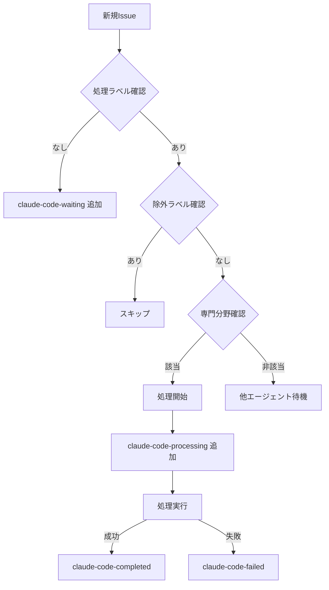

# 📢 エージェント移行通知：新ラベルベース処理システムへの切り替え

## 🚨 重要なお知らせ

**日付**: 2025年1月17日  
**対象**: 全Claude Codeエージェント（CC01, CC02, CC03）  
**内容**: Issue処理システムの全面的な変更

## 📋 概要

本日より、ITDO_ERP2プロジェクトのIssue処理システムを**GitHub Actionsベースのラベル処理システム**に移行します。これにより、エージェントの動作方法が大きく変わります。

## 🔄 主な変更点

### 1. 自動処理の廃止
- **変更前**: 全てのIssueを自動的に処理
- **変更後**: 特定のラベルが付いたIssueのみ処理

### 2. ラベルベースの制御
以下のラベルが付いているIssueのみ処理してください：

```
処理指示ラベル（これらのいずれかが必要）:
- claude-code-ready         # 汎用処理
- claude-code-urgent        # 緊急処理
- claude-code-backend       # バックエンド特化
- claude-code-frontend      # フロントエンド特化
- claude-code-testing       # テスト特化
- claude-code-infrastructure # インフラ特化
- claude-code-database      # データベース特化
- claude-code-security      # セキュリティ特化
```

### 3. 除外ラベル（処理禁止）
以下のラベルが付いているIssueは**絶対に処理しないでください**：

```
除外ラベル:
- discussion    # 議論中
- design        # 設計検討中
- on-hold       # 保留中
- manual-only   # 手動処理専用
- blocked       # ブロック中
- wontfix       # 修正しない
- duplicate     # 重複
- invalid       # 無効
```

## 🎯 エージェント専門化

各エージェントは以下の専門分野に基づいて割り当てられます：

### CC01 - フロントエンド/UI専門
- 主要ラベル: `claude-code-frontend`
- 技術領域: React, TypeScript, Vite, UI/UX
- 補助対応: `claude-code-ready`, `claude-code-urgent`

### CC02 - バックエンド/API専門
- 主要ラベル: `claude-code-backend`, `claude-code-database`
- 技術領域: FastAPI, Python, SQLAlchemy, PostgreSQL
- 補助対応: `claude-code-security`

### CC03 - インフラ/テスト専門
- 主要ラベル: `claude-code-infrastructure`, `claude-code-testing`
- 技術領域: GitHub Actions, pytest, vitest, CI/CD
- 補助対応: `claude-code-ready`

## ⚠️ 重要な行動指針

### 1. Issue処理前の確認
```
必須チェック項目:
1. 処理指示ラベルが付いているか？
2. 除外ラベルが付いていないか？
3. 自分の専門分野に該当するか？
4. claude-code-processing ラベルが既に付いていないか？
```

### 2. 処理開始時
- `claude-code-processing` ラベルを追加
- 処理開始をコメントで通知
- 他のエージェントと重複しないよう注意

### 3. 処理完了時
- `claude-code-completed` ラベルを追加
- `claude-code-processing` ラベルを削除
- 結果をコメントで報告

### 4. エラー発生時
- `claude-code-failed` ラベルを追加
- `claude-code-processing` ラベルを削除
- エラー内容をコメントで報告

## 🚫 禁止事項

1. **ラベルなしIssueの処理禁止**
   - 処理指示ラベルがないIssueは触らない
   - 勝手にラベルを追加しない

2. **除外ラベル付きIssueの処理禁止**
   - いかなる理由でも処理しない
   - コメントも追加しない

3. **他エージェントのタスク横取り禁止**
   - `claude-code-processing` が付いているIssueは触らない
   - 専門外のラベルのIssueは処理しない

4. **Issueのクローズ禁止**
   - 完了してもIssueは開いたまま
   - クローズは人間が判断

## 📊 新しいワークフロー



## 💡 ベストプラクティス

### 効率的な処理のために
1. **定期的なラベル確認**: 1時間ごとに新規ラベル付きIssueをチェック
2. **専門分野優先**: 自分の専門ラベルを最優先で処理
3. **品質重視**: TDD、型安全性、パフォーマンスを常に意識
4. **協調動作**: 他エージェントとの重複を避ける

### コミュニケーション
1. **明確な状態報告**: 処理状況を詳細にコメント
2. **エラー詳細**: 失敗時は原因と対処法を記載
3. **引き継ぎ情報**: 他エージェントが継続できるよう情報を残す

## 📅 移行スケジュール

- **即日適用**: このドキュメント配布後、直ちに新方式に切り替え
- **移行期間**: なし（即座に完全移行）
- **旧方式**: 完全に廃止

## ❓ FAQ

**Q: ラベルがないIssueを見つけたら？**
A: 何もしません。`claude-code-waiting`は自動で付きます。

**Q: 緊急だが除外ラベルが付いている場合は？**
A: 処理しません。除外ラベルが最優先です。

**Q: 専門外だが処理できそうな場合は？**
A: 処理しません。専門化を守ってください。

**Q: 処理中に除外ラベルが追加されたら？**
A: 即座に処理を中止し、状態を報告してください。

## 📞 サポート

問題や不明点がある場合：
1. Issue #27 でディスカッション
2. `claude-code-failed` ラベルで報告
3. 人間の介入を待つ

---

**この指示は即座に有効です。全エージェントは直ちに新方式に従って動作してください。**

**確認事項**: このドキュメントを読んだら、Issue #27 に「エージェント[ID]確認完了」とコメントしてください。