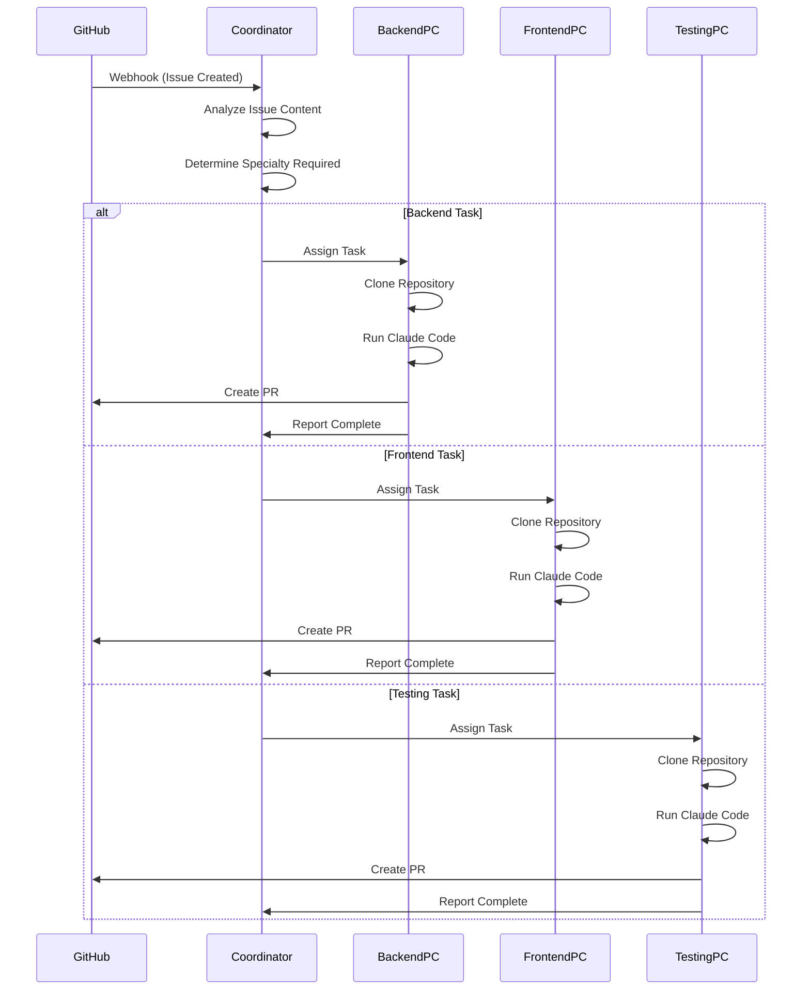
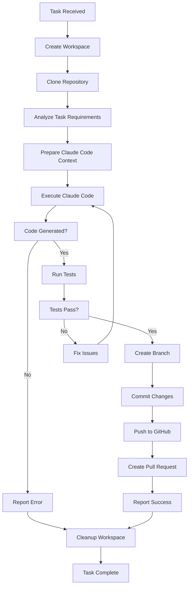

# Claude Code Cluster - アーキテクチャ設計書

## 🎯 概要

Claude Code Cluster は、複数のPCで **Claude Code CLI** を分散実行する協調開発システムです。

### 基本コンセプト
- **Claude Code** を各PCで独立実行
- **GitHub Issue** 駆動の自動開発ワークフロー
- **専門分野別PC** での効率的なタスク分散
- **完全に独立したワークスペース** での並行開発

## 🏗️ システムアーキテクチャ

### 全体構成

```
┌─────────────────────────────────────────────────────────────────┐
│                    GitHub Repository                            │
│  Issues → Webhooks → PRs ← Git Operations ← Claude Code        │
└─────────────────────┬───────────────────────────────────────────┘
                      │
┌─────────────────────▼───────────────────────────────────────────┐
│                 Central Coordinator                             │
│  ┌─────────────┐ ┌─────────────┐ ┌─────────────┐ ┌──────────┐  │
│  │Task Manager │ │Agent Manager│ │GitHub Client│ │ Webhook  │  │
│  │             │ │             │ │             │ │ Server   │  │
│  └─────────────┘ └─────────────┘ └─────────────┘ └──────────┘  │
│                    PostgreSQL + Redis                           │
└─────────────────────┬───────────────────────────────────────────┘
                      │ Task Distribution & Coordination
        ┌─────────────┼─────────────┼─────────────┼─────────────┐
        │             │             │             │             │
┌───────▼──────┐ ┌────▼─────┐ ┌────▼─────┐ ┌────▼─────┐ ┌────▼─────┐
│ Backend PC   │ │Frontend  │ │Testing   │ │DevOps    │ │General   │
│              │ │PC        │ │PC        │ │PC        │ │PC        │
├──────────────┤ ├──────────┤ ├──────────┤ ├──────────┤ ├──────────┤
│Claude Code   │ │Claude    │ │Claude    │ │Claude    │ │Claude    │
│+ Python/API  │ │Code +    │ │Code +    │ │Code +    │ │Code +    │
│Tools         │ │React/UI  │ │Test      │ │Docker/   │ │Any       │
│              │ │Tools     │ │Tools     │ │CI Tools  │ │          │
├──────────────┤ ├──────────┤ ├──────────┤ ├──────────┤ ├──────────┤
│Independent   │ │Independent│ │Independent│ │Independent│ │Independent│
│Workspace     │ │Workspace │ │Workspace │ │Workspace │ │Workspace │
│/repo1        │ │/repo2    │ │/repo3    │ │/repo4    │ │/repo5    │
└──────────────┘ └──────────┘ └──────────┘ └──────────┘ └──────────┘
```

## 🖥️ コンポーネント詳細

### 1. Central Coordinator（調整サーバー）

**役割**: タスクの分散・調整・状態管理

**主要機能**:
- GitHub Webhook受信とIssue解析
- タスクの専門分野判定と最適PC割り当て
- 各PCの状態監視とヘルスチェック
- タスク進捗管理とエラーハンドリング

**技術スタック**:
```python
# FastAPI サーバー
- FastAPI (RESTful API)
- PostgreSQL (タスク・状態管理)
- Redis (リアルタイム通信・キュー)
- Celery (バックグラウンドタスク)
```

**主要API**:
```
POST /webhook/github     # GitHub Webhook受信
GET  /tasks             # タスク一覧
POST /tasks/{id}/assign # タスク割り当て
GET  /agents            # Agent PC状態
POST /agents/heartbeat  # ヘルスチェック
```

### 2. Agent PC（実行ノード）

**役割**: Claude Codeを使用した実際の開発作業

**各PCの構成**:
```bash
# 各PC上のディレクトリ構成
/claude-code-agent/
├── agent-daemon.py           # Agent制御デーモン
├── workspaces/              # 独立ワークスペース
│   ├── repo-task-001/       # タスク1用ワークスペース
│   ├── repo-task-002/       # タスク2用ワークスペース
│   └── ...
├── config/
│   ├── agent.yml           # Agent設定
│   └── specialties.yml     # 専門分野設定
└── logs/
    └── agent.log           # 実行ログ
```

**主要機能**:
- Coordinatorからのタスク受信
- 独立ワークスペースの作成・管理
- Claude Codeを使用したコード生成・編集
- テスト実行とPR作成
- 作業完了の報告

### 3. 専門分野別PC構成

#### Backend PC
```yaml
specialties: [backend, api, database, server]
tools:
  - Python 3.11+
  - Claude Code CLI
  - Poetry/uv (package management)
  - PostgreSQL/MySQL clients
  - Redis client
  - Docker
environments:
  - FastAPI development
  - Django development  
  - Database management
  - API testing tools
```

#### Frontend PC
```yaml
specialties: [frontend, ui, react, javascript, typescript]
tools:
  - Node.js 20+ 
  - Claude Code CLI
  - npm/yarn
  - TypeScript
  - React Developer Tools
  - Browser automation
environments:
  - React/Next.js development
  - CSS/SCSS processing
  - UI component libraries
  - Browser testing
```

#### Testing PC
```yaml
specialties: [testing, qa, pytest, jest, e2e]
tools:
  - Python + pytest
  - Node.js + Jest
  - Claude Code CLI
  - Selenium/Playwright
  - Coverage tools
environments:
  - Unit testing frameworks
  - Integration testing
  - E2E testing tools
  - Performance testing
```

#### DevOps PC
```yaml
specialties: [devops, docker, ci, cd, infrastructure]
tools:
  - Docker + Docker Compose
  - Claude Code CLI
  - Terraform/Ansible
  - Kubernetes tools
  - Cloud CLI tools (AWS/GCP/Azure)
environments:
  - Container development
  - Infrastructure as Code
  - CI/CD pipeline tools
  - Monitoring tools
```

## 🔄 ワークフロー

### 1. Issue駆動開発フロー



### 2. タスク実行詳細フロー



## 💾 データモデル

### Task テーブル
```sql
CREATE TABLE tasks (
    id UUID PRIMARY KEY,
    github_issue_id INTEGER NOT NULL,
    repository_name VARCHAR(255) NOT NULL,
    title TEXT NOT NULL,
    description TEXT,
    requirements JSONB, -- 技術要件
    specialty VARCHAR(50), -- backend/frontend/testing/devops
    priority VARCHAR(20) DEFAULT 'medium',
    status VARCHAR(20) DEFAULT 'pending',
    assigned_agent_id VARCHAR(100),
    workspace_path VARCHAR(500),
    pr_url VARCHAR(500),
    created_at TIMESTAMP DEFAULT NOW(),
    started_at TIMESTAMP,
    completed_at TIMESTAMP,
    error_message TEXT
);
```

### Agent テーブル
```sql
CREATE TABLE agents (
    id VARCHAR(100) PRIMARY KEY,
    hostname VARCHAR(255) NOT NULL,
    specialties VARCHAR(255)[], -- 専門分野配列
    status VARCHAR(20) DEFAULT 'offline',
    current_tasks INTEGER DEFAULT 0,
    max_concurrent_tasks INTEGER DEFAULT 2,
    last_heartbeat TIMESTAMP,
    system_info JSONB, -- CPU, Memory, Disk情報
    claude_code_version VARCHAR(50),
    workspace_root VARCHAR(500)
);
```

## 🔧 実装詳細

### Agent Daemon（各PC）

```python
# agent-daemon.py
import asyncio
import subprocess
import tempfile
from pathlib import Path

class ClaudeCodeAgent:
    def __init__(self, agent_id: str, specialties: list):
        self.agent_id = agent_id
        self.specialties = specialties
        self.workspace_root = Path("/claude-code-agent/workspaces")
        
    async def execute_task(self, task: dict) -> dict:
        """Claude Codeを使用してタスクを実行"""
        workspace = self.create_workspace(task['id'])
        
        try:
            # 1. Repository clone
            await self.clone_repository(task['repository'], workspace)
            
            # 2. Claude Code context準備
            context = self.prepare_claude_context(task, workspace)
            
            # 3. Claude Code実行
            result = await self.run_claude_code(context, workspace)
            
            # 4. テスト実行
            test_result = await self.run_tests(workspace)
            
            # 5. PR作成
            if test_result['success']:
                pr_url = await self.create_pull_request(task, workspace)
                return {'success': True, 'pr_url': pr_url}
            else:
                return {'success': False, 'error': test_result['error']}
                
        finally:
            self.cleanup_workspace(workspace)
    
    async def run_claude_code(self, context: str, workspace: Path) -> dict:
        """Claude Code CLIを実行"""
        cmd = [
            'claude-code',
            '--directory', str(workspace),
            '--prompt', context
        ]
        
        process = await asyncio.create_subprocess_exec(
            *cmd,
            stdout=asyncio.subprocess.PIPE,
            stderr=asyncio.subprocess.PIPE,
            cwd=workspace
        )
        
        stdout, stderr = await process.communicate()
        
        return {
            'success': process.returncode == 0,
            'output': stdout.decode(),
            'error': stderr.decode() if stderr else None
        }
```

### Coordinator API

```python
# coordinator/main.py
from fastapi import FastAPI, HTTPException
from sqlalchemy.orm import Session
from .database import get_db
from .models import Task, Agent
from .github_client import GitHubClient

app = FastAPI()

@app.post("/webhook/github")
async def github_webhook(payload: dict, db: Session = Depends(get_db)):
    """GitHub webhookを処理"""
    if payload['action'] == 'opened' and 'issue' in payload:
        issue = payload['issue']
        
        # Issue解析
        requirements = analyze_issue_requirements(issue)
        specialty = determine_specialty(requirements)
        
        # タスク作成
        task = Task(
            github_issue_id=issue['number'],
            repository_name=payload['repository']['full_name'],
            title=issue['title'],
            description=issue['body'],
            requirements=requirements,
            specialty=specialty
        )
        db.add(task)
        db.commit()
        
        # Agent割り当て
        await assign_task_to_agent(task.id, specialty)
        
        return {"status": "task_created", "task_id": task.id}

async def assign_task_to_agent(task_id: str, specialty: str):
    """最適なAgentにタスクを割り当て"""
    # 専門分野に合致し、負荷の低いAgentを選択
    suitable_agents = db.query(Agent).filter(
        Agent.specialties.contains([specialty]),
        Agent.status == 'online',
        Agent.current_tasks < Agent.max_concurrent_tasks
    ).order_by(Agent.current_tasks).all()
    
    if suitable_agents:
        agent = suitable_agents[0]
        
        # Agent にタスクを送信
        async with httpx.AsyncClient() as client:
            response = await client.post(
                f"http://{agent.hostname}:8000/tasks",
                json={"task_id": task_id}
            )
            
        if response.status_code == 200:
            # Agent の現在タスク数を更新
            agent.current_tasks += 1
            db.commit()
```

## 🌐 ネットワーク設計

### ポート設定
```
Coordinator Server:
- 8080: Main API server
- 5432: PostgreSQL 
- 6379: Redis
- 80/443: Webhook endpoint (reverse proxy)

Agent PCs:
- 8000: Agent API endpoint
- 22: SSH (management)
```

### セキュリティ
```bash
# Firewall rules for each PC
# Coordinator
ufw allow 8080/tcp  # API
ufw allow 80,443/tcp # Webhooks
ufw allow from 192.168.1.0/24 to any port 5432 # PostgreSQL
ufw allow from 192.168.1.0/24 to any port 6379 # Redis

# Agent PCs  
ufw allow from 192.168.1.10 to any port 8000 # Only Coordinator
ufw allow 22/tcp # SSH management
```

## 📊 監視・運用

### メトリクス収集
```python
# Prometheus metrics
task_execution_time = Histogram('task_execution_seconds')
task_success_rate = Counter('tasks_completed_total', ['status'])
agent_utilization = Gauge('agent_current_tasks', ['agent_id'])
claude_code_errors = Counter('claude_code_errors_total', ['error_type'])
```

### ヘルスチェック
```bash
# 各PCでの定期チェック
curl http://coordinator:8080/health
curl http://agent-backend:8000/health
curl http://agent-frontend:8000/health
claude-code --version  # Claude Code動作確認
```

## 🚀 デプロイメント

### 必要な前提条件
1. **各PC**: Ubuntu 22.04 LTS, Docker, Python 3.11+
2. **Claude Code**: 全PCにインストール済み
3. **GitHub**: Personal Access Tokens（各PCごと）
4. **ネットワーク**: 全PC間の通信可能

### 自動デプロイスクリプト
```bash
#!/bin/bash
# deploy-cluster.sh

# Coordinator setup
ansible-playbook -i inventory/coordinator coordinator/deploy.yml

# Agent PCs setup  
ansible-playbook -i inventory/agents agents/deploy.yml

# Verification
./scripts/health-check.sh
```

---

**重要**: この設計書は、Claude CodeをベースとしたクラスターシステムのPoCアーキテクチャです。実装時は Claude Code の具体的な機能・制限に応じて詳細調整が必要です。