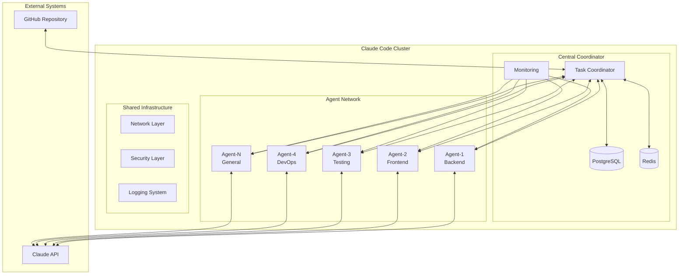
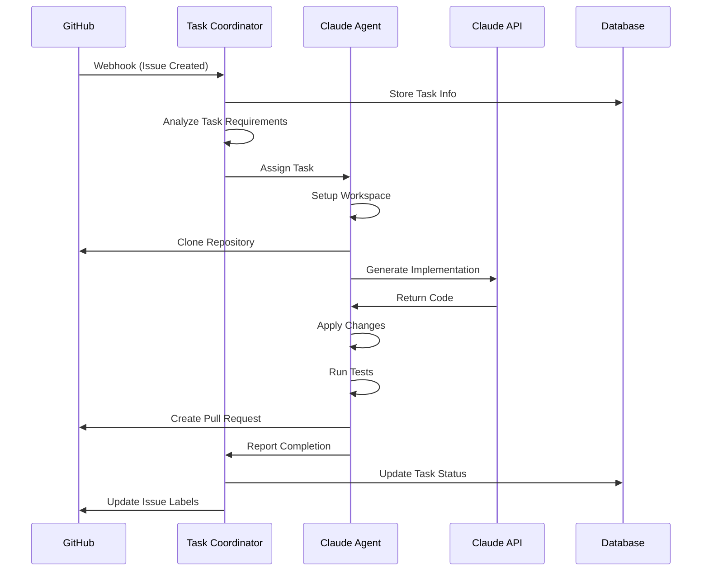
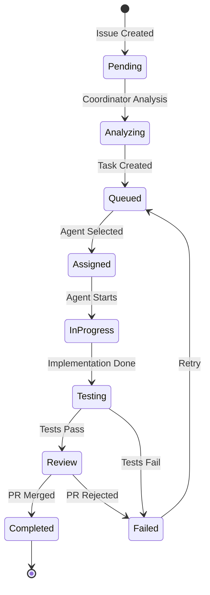

# システムアーキテクチャ概要

Claude Code Clusterの全体設計と各コンポーネントの役割

## 🎯 設計思想

### 核となる原則

1. **分散自律性**: 各AgentがCentral Coordinatorに依存しすぎず、独立して動作
2. **専門特化**: Backend、Frontend、Testing等の専門性を持つAgent配置
3. **フォルトトレラント**: 単一障害点の排除と自動復旧機能
4. **スケーラビリティ**: 需要に応じたAgent追加・削除の容易性
5. **可観測性**: 全てのコンポーネントの状態とパフォーマンスを監視

### アーキテクチャパターン



## 🧩 コンポーネント設計

### 1. Central Coordinator

**役割**
- タスクの分析と最適なAgentへの割り当て
- Agentの状態監視とヘルスチェック
- GitHub APIとの統合管理
- 全体の負荷分散とスケジューリング

**主要機能**

```python
class CentralCoordinator:
    """中央調整システムのコアクラス"""
    
    async def analyze_task(self, github_issue: GitHubIssue) -> TaskAnalysis:
        """GitHubのIssueを分析してタスクプランを作成"""
        
    async def assign_task(self, task: Task) -> AgentAssignment:
        """最適なAgentにタスクを割り当て"""
        
    async def monitor_agents(self) -> List[AgentStatus]:
        """全Agentの状態を監視"""
        
    async def coordinate_workflow(self, tasks: List[Task]) -> WorkflowPlan:
        """複数タスク間の依存関係を調整"""
```

### 2. Claude Code Agent

**役割**
- 専門分野のコード生成・修正の実行
- 独立したワークスペースでの作業
- Git操作とPull Request作成
- タスク実行結果のCoordinatorへの報告

**Agent種別**

| Agent種別 | 専門分野 | 主要スキル |
|-----------|----------|------------|
| Backend Specialist | サーバーサイド | Python, FastAPI, PostgreSQL, Redis |
| Frontend Specialist | クライアントサイド | TypeScript, React, CSS, UI/UX |
| Testing Specialist | 品質保証 | pytest, Jest, Selenium, QA |
| DevOps Specialist | インフラ・CI/CD | Docker, Ansible, GitHub Actions |
| Database Specialist | データ層 | PostgreSQL, Redis, Migration |
| Security Specialist | セキュリティ | 認証, 認可, 脆弱性検査 |
| Documentation Specialist | ドキュメント | Markdown, API Doc, Tutorial |
| General Purpose | 汎用 | 全般的なプログラミング |

**Agent内部アーキテクチャ**

```python
class ClaudeCodeAgent:
    """個別Agentのコアクラス"""
    
    def __init__(self, specialties: List[str], workspace_path: Path):
        self.specialties = specialties
        self.workspace = AgentWorkspace(workspace_path)
        self.claude_client = ClaudeAPIClient()
        self.github_client = GitHubAPIClient()
        
    async def execute_task(self, task: Task) -> TaskResult:
        """メインタスク実行フロー"""
        
        # 1. ワークスペース準備
        workspace = await self.workspace.prepare_for_task(task)
        
        # 2. コードベース分析
        analysis = await self.analyze_codebase(workspace)
        
        # 3. Claude APIで実装
        implementation = await self.generate_implementation(task, analysis)
        
        # 4. コード適用
        changes = await self.apply_changes(workspace, implementation)
        
        # 5. テスト実行
        test_results = await self.run_tests(workspace)
        
        # 6. Git操作
        branch = await self.create_branch_and_commit(workspace, changes)
        
        # 7. Pull Request作成
        pr = await self.create_pull_request(branch, task)
        
        return TaskResult(
            status="completed",
            pr_url=pr.url,
            changes=changes,
            test_results=test_results
        )
```

### 3. Workspace Management

**独立ワークスペース設計**

```
/workspace/
├── agent-001/
│   ├── tasks/
│   │   ├── task-12345/          # Issue #12345
│   │   │   ├── repo-clone/      # リポジトリクローン
│   │   │   ├── implementation/  # 実装ファイル
│   │   │   ├── tests/          # テストファイル
│   │   │   └── metadata.json   # タスクメタデータ
│   │   └── task-12346/
│   ├── shared/
│   │   ├── templates/          # コードテンプレート
│   │   ├── tools/             # 開発ツール
│   │   └── cache/             # キャッシュファイル
│   └── logs/
│       ├── task-execution.log
│       └── agent-activity.log
```

**ワークスペース分離機能**

```python
class AgentWorkspace:
    """Agent専用ワークスペース管理"""
    
    def __init__(self, base_path: Path, agent_id: str):
        self.base_path = base_path
        self.agent_id = agent_id
        
    async def prepare_for_task(self, task: Task) -> TaskWorkspace:
        """タスク専用ワークスペースを準備"""
        task_path = self.base_path / f"tasks/task-{task.id}"
        task_path.mkdir(parents=True, exist_ok=True)
        
        # リポジトリクローン
        repo_path = await self.clone_repository(task_path, task.repository_url)
        
        # 環境変数設定
        env_vars = await self.setup_environment(task_path, task.requirements)
        
        return TaskWorkspace(
            path=task_path,
            repository_path=repo_path,
            environment=env_vars
        )
        
    async def cleanup_completed_tasks(self, retention_days: int = 7):
        """完了したタスクのクリーンアップ"""
        cutoff_date = datetime.now() - timedelta(days=retention_days)
        
        for task_dir in (self.base_path / "tasks").iterdir():
            if task_dir.stat().st_mtime < cutoff_date.timestamp():
                shutil.rmtree(task_dir)
```

## 🔄 データフロー設計

### タスク実行フロー



### 状態管理

**タスク状態遷移**



**Agent状態管理**

```python
class AgentState(Enum):
    OFFLINE = "offline"
    IDLE = "idle" 
    BUSY = "busy"
    OVERLOADED = "overloaded"
    MAINTENANCE = "maintenance"
    ERROR = "error"

class AgentStatus:
    def __init__(self):
        self.state: AgentState = AgentState.OFFLINE
        self.current_tasks: List[str] = []
        self.capabilities: List[str] = []
        self.load_percentage: float = 0.0
        self.last_heartbeat: datetime = None
        
    def can_accept_task(self, task: Task) -> bool:
        """タスクを受け入れ可能かチェック"""
        return (
            self.state == AgentState.IDLE and
            len(self.current_tasks) < MAX_CONCURRENT_TASKS and
            any(cap in task.requirements for cap in self.capabilities)
        )
```

## 🔧 通信プロトコル

### API設計

**RESTful API**

```yaml
# Coordinator API
/api/v1/tasks:
  POST: タスク作成
  GET: タスク一覧取得
  
/api/v1/tasks/{task_id}:
  GET: タスク詳細取得
  PUT: タスク更新
  DELETE: タスク削除
  
/api/v1/agents:
  GET: Agent一覧取得
  POST: Agent登録
  
/api/v1/agents/{agent_id}:
  GET: Agent詳細取得
  PUT: Agent状態更新
  
/api/v1/agents/{agent_id}/tasks:
  GET: Agent担当タスク一覧
  POST: タスク割り当て

# Agent API  
/health:
  GET: ヘルスチェック
  
/status:
  GET: Agent状態取得
  
/execute_task:
  POST: タスク実行
  
/cancel_task/{task_id}:
  POST: タスクキャンセル
```

**WebSocket通信**

```python
class CoordinatorWebSocket:
    """Coordinator ↔ Agent間のリアルタイム通信"""
    
    async def handle_agent_connection(self, websocket: WebSocket, agent_id: str):
        """Agent接続ハンドリング"""
        await websocket.accept()
        
        try:
            while True:
                # ハートビート受信
                message = await websocket.receive_json()
                
                if message["type"] == "heartbeat":
                    await self.update_agent_status(agent_id, message["status"])
                    
                elif message["type"] == "task_progress":
                    await self.update_task_progress(message["task_id"], message["progress"])
                    
                elif message["type"] == "task_completed":
                    await self.handle_task_completion(message["task_id"], message["result"])
                    
        except WebSocketDisconnect:
            await self.handle_agent_disconnect(agent_id)
```

## 🔐 セキュリティアーキテクチャ

### 多層防御

```
┌─────────────────────────────────────────────────────────────┐
│                        Internet                             │
└─────────────────────┬───────────────────────────────────────┘
                      │
┌─────────────────────▼───────────────────────────────────────┐
│                 Firewall Layer                              │
│  - DDoS Protection                                          │
│  - IP Filtering                                             │
│  - Rate Limiting                                            │
└─────────────────────┬───────────────────────────────────────┘
                      │
┌─────────────────────▼───────────────────────────────────────┐
│               Network Security Layer                        │
│  - VPN (Optional)                                           │
│  - TLS 1.3 Encryption                                       │
│  - Network Segmentation                                     │
└─────────────────────┬───────────────────────────────────────┘
                      │
┌─────────────────────▼───────────────────────────────────────┐
│             Application Security Layer                      │
│  - JWT Authentication                                       │
│  - API Key Management                                       │
│  - Input Validation                                         │
└─────────────────────┬───────────────────────────────────────┘
                      │
┌─────────────────────▼───────────────────────────────────────┐
│               Data Security Layer                           │
│  - Encryption at Rest                                       │
│  - Secure Configuration                                     │
│  - Audit Logging                                            │
└─────────────────────────────────────────────────────────────┘
```

### 認証・認可フロー

```python
class SecurityManager:
    """セキュリティ管理の中央システム"""
    
    async def authenticate_agent(self, agent_credentials: AgentCredentials) -> AuthResult:
        """Agent認証"""
        
        # 1. 証明書検証
        cert_valid = await self.verify_client_certificate(agent_credentials.cert)
        
        # 2. API Key検証
        api_key_valid = await self.verify_api_key(agent_credentials.api_key)
        
        # 3. Agent登録状態確認
        agent_registered = await self.check_agent_registration(agent_credentials.agent_id)
        
        if all([cert_valid, api_key_valid, agent_registered]):
            # JWT トークン発行
            token = await self.generate_jwt_token(agent_credentials.agent_id)
            return AuthResult(success=True, token=token)
        else:
            return AuthResult(success=False, error="Authentication failed")
    
    async def authorize_task_access(self, agent_id: str, task: Task) -> bool:
        """タスクアクセス権限確認"""
        agent = await self.get_agent(agent_id)
        
        # Agent の専門性とタスク要件をマッチング
        capabilities_match = any(
            cap in task.requirements for cap in agent.capabilities
        )
        
        # タスクの機密レベル確認
        security_clearance = await self.check_security_clearance(agent_id, task.security_level)
        
        return capabilities_match and security_clearance
```

## 📊 監視・可観測性

### メトリクス収集

**システムメトリクス**
```python
# Prometheus メトリクス定義
from prometheus_client import Counter, Histogram, Gauge

# タスク関連メトリクス
TASKS_TOTAL = Counter('claude_tasks_total', 'Total number of tasks', ['status', 'agent_type'])
TASK_DURATION = Histogram('claude_task_duration_seconds', 'Task execution time')
ACTIVE_TASKS = Gauge('claude_active_tasks', 'Number of active tasks')

# Agent関連メトリクス
AGENTS_TOTAL = Gauge('claude_agents_total', 'Total number of agents')
AGENT_LOAD = Gauge('claude_agent_load', 'Agent load percentage', ['agent_id'])

# API関連メトリクス
API_REQUESTS = Counter('claude_api_requests_total', 'Total API requests', ['endpoint', 'method'])
API_DURATION = Histogram('claude_api_duration_seconds', 'API request duration')
```

### 分散トレーシング

```python
import opentelemetry
from opentelemetry.trace import Tracer

class TaskExecutionTracer:
    """タスク実行の分散トレーシング"""
    
    def __init__(self, tracer: Tracer):
        self.tracer = tracer
        
    async def trace_task_execution(self, task: Task, agent: Agent):
        """タスク実行全体をトレース"""
        
        with self.tracer.start_as_current_span("task_execution") as span:
            span.set_attribute("task.id", task.id)
            span.set_attribute("task.type", task.type)
            span.set_attribute("agent.id", agent.id)
            
            try:
                # 各フェーズをトレース
                await self.trace_workspace_setup(task, agent)
                await self.trace_code_generation(task, agent)
                await self.trace_testing(task, agent)
                await self.trace_git_operations(task, agent)
                
                span.set_status(Status(StatusCode.OK))
                
            except Exception as e:
                span.set_status(Status(StatusCode.ERROR, str(e)))
                span.record_exception(e)
                raise
```

## 🚀 拡張性設計

### 水平スケーリング

**Agent追加の自動化**

```python
class ClusterManager:
    """クラスター管理システム"""
    
    async def auto_scale_agents(self, target_load: float = 0.7):
        """負荷に基づくAgent自動スケーリング"""
        
        current_load = await self.calculate_cluster_load()
        
        if current_load > target_load:
            # Agent追加
            await self.provision_new_agent()
            
        elif current_load < (target_load * 0.3):
            # Agent削減
            await self.decommission_idle_agent()
    
    async def provision_new_agent(self):
        """新しいAgentのプロビジョニング"""
        
        # 1. 最も負荷の高い専門分野を特定
        bottleneck_specialty = await self.identify_bottleneck_specialty()
        
        # 2. 対応するAgentタイプを決定
        agent_type = self.get_agent_type_for_specialty(bottleneck_specialty)
        
        # 3. インフラリソースの確保
        infrastructure = await self.provision_infrastructure(agent_type)
        
        # 4. Agent設定とデプロイ
        await self.deploy_agent(infrastructure, agent_type)
        
        # 5. Coordinatorに登録
        await self.register_agent_with_coordinator(infrastructure.agent_id)
```

### プラグインアーキテクチャ

```python
class PluginManager:
    """プラグイン管理システム"""
    
    def __init__(self):
        self.plugins: Dict[str, Plugin] = {}
        
    async def load_plugin(self, plugin_config: PluginConfig):
        """プラグインの動的ロード"""
        
        plugin_module = importlib.import_module(plugin_config.module_path)
        plugin_class = getattr(plugin_module, plugin_config.class_name)
        
        plugin_instance = plugin_class(plugin_config.settings)
        await plugin_instance.initialize()
        
        self.plugins[plugin_config.name] = plugin_instance
    
    async def execute_plugin_hook(self, hook_name: str, context: Dict[str, Any]):
        """プラグインフックの実行"""
        
        for plugin in self.plugins.values():
            if hasattr(plugin, hook_name):
                await getattr(plugin, hook_name)(context)
```

この設計により、Claude Code Clusterは高い拡張性と信頼性を持つ分散システムとして動作します。