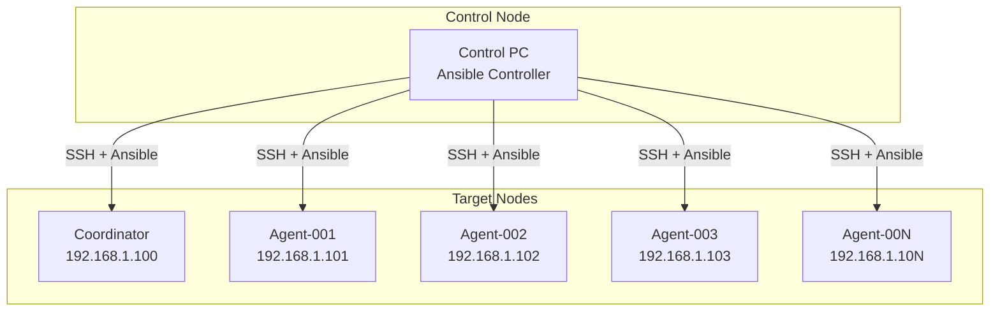

# デプロイメント自動化

Claude Code Clusterの自動デプロイメントシステム

## 🎯 自動化概要

### デプロイメント戦略



## 📋 Ansibleプレイブック

### 1. インベントリファイル

```ini
# inventory/hosts.ini
[coordinators]
coordinator ansible_host=192.168.1.100 ansible_user=claude

[agents]
agent-001 ansible_host=192.168.1.101 ansible_user=claude agent_specialty=backend
agent-002 ansible_host=192.168.1.102 ansible_user=claude agent_specialty=frontend
agent-003 ansible_host=192.168.1.103 ansible_user=claude agent_specialty=testing
agent-004 ansible_host=192.168.1.104 ansible_user=claude agent_specialty=devops

[cluster:children]
coordinators
agents

[cluster:vars]
ansible_ssh_private_key_file=~/.ssh/claude_cluster_key
ansible_python_interpreter=/usr/bin/python3
```

### 2. 全体セットアップ

```yaml
# playbooks/site.yml
---
- name: Claude Code Cluster Full Deployment
  hosts: localhost
  gather_facts: false
  tasks:
    - name: Include pre-flight checks
      include: pre-flight-checks.yml
    
    - name: Setup coordinator
      include: coordinator-setup.yml
      
    - name: Setup agents
      include: agents-setup.yml
      
    - name: Verify deployment
      include: post-deployment-verification.yml

- name: Pre-flight System Checks
  hosts: cluster
  become: yes
  tasks:
    - name: Check system requirements
      include_tasks: tasks/system-checks.yml
    
    - name: Setup SSH keys
      include_tasks: tasks/ssh-setup.yml
    
    - name: Install base packages
      include_tasks: tasks/base-packages.yml
```

### 3. Coordinator セットアップ

```yaml
# playbooks/coordinator-setup.yml
---
- name: Setup Claude Code Coordinator
  hosts: coordinators
  become: yes
  vars:
    coordinator_port: 8080
    postgres_port: 5432
    redis_port: 6379
    grafana_port: 3000
    prometheus_port: 9090
    
  tasks:
    - name: Create coordinator user
      user:
        name: coordinator
        system: yes
        home: /opt/coordinator
        shell: /bin/bash
        create_home: yes
    
    - name: Install Docker and Docker Compose
      include_tasks: tasks/docker-setup.yml
    
    - name: Create coordinator directory structure
      file:
        path: "{{ item }}"
        state: directory
        owner: coordinator
        group: coordinator
        mode: '0755'
      loop:
        - /opt/coordinator
        - /opt/coordinator/src
        - /opt/coordinator/config
        - /opt/coordinator/logs
        - /opt/coordinator/data
        - /opt/coordinator/backup
    
    - name: Deploy coordinator source code
      synchronize:
        src: ../coordinator/
        dest: /opt/coordinator/
        owner: no
        group: no
        delete: yes
        rsync_opts:
          - "--exclude=__pycache__"
          - "--exclude=*.pyc"
          - "--exclude=.git"
    
    - name: Set ownership of coordinator files
      file:
        path: /opt/coordinator
        owner: coordinator
        group: coordinator
        recurse: yes
    
    - name: Template coordinator configuration
      template:
        src: templates/coordinator-config.env.j2
        dest: /opt/coordinator/.env
        owner: coordinator
        group: coordinator
        mode: '0600'
    
    - name: Template docker-compose file
      template:
        src: templates/docker-compose.coordinator.yml.j2
        dest: /opt/coordinator/docker-compose.yml
        owner: coordinator
        group: coordinator
        mode: '0644'
    
    - name: Start coordinator services
      docker_compose:
        project_src: /opt/coordinator
        state: present
        pull: yes
      become_user: coordinator
    
    - name: Create systemd service
      template:
        src: templates/coordinator.service.j2
        dest: /etc/systemd/system/claude-coordinator.service
        mode: '0644'
      notify:
        - reload systemd
        - start coordinator service
    
    - name: Setup log rotation
      template:
        src: templates/coordinator-logrotate.j2
        dest: /etc/logrotate.d/claude-coordinator
        mode: '0644'
    
    - name: Configure firewall
      ufw:
        rule: allow
        port: "{{ item }}"
        proto: tcp
      loop:
        - "{{ coordinator_port }}"
        - "{{ grafana_port }}"
        - "22"
    
    - name: Enable and start coordinator service
      systemd:
        name: claude-coordinator
        enabled: yes
        state: started
        daemon_reload: yes

  handlers:
    - name: reload systemd
      systemd:
        daemon_reload: yes
    
    - name: start coordinator service
      systemd:
        name: claude-coordinator
        state: started
```

### 4. Agent セットアップ

```yaml
# playbooks/agents-setup.yml
---
- name: Setup Claude Code Agents
  hosts: agents
  become: yes
  vars:
    agent_port: 8081
    coordinator_host: "{{ hostvars[groups['coordinators'][0]]['ansible_host'] }}"
    
  tasks:
    - name: Create agent user
      user:
        name: agent
        system: yes
        home: /opt/agent
        shell: /bin/bash
        create_home: yes
        groups: docker
    
    - name: Install development tools
      include_tasks: tasks/dev-tools-setup.yml
    
    - name: Create agent directory structure
      file:
        path: "{{ item }}"
        state: directory
        owner: agent
        group: agent
        mode: '0755'
      loop:
        - /opt/agent
        - /opt/agent/src
        - /opt/agent/workspace
        - /opt/agent/config
        - /opt/agent/logs
        - /opt/agent/cache
    
    - name: Deploy agent source code
      synchronize:
        src: ../agent/
        dest: /opt/agent/
        owner: no
        group: no
        delete: yes
        rsync_opts:
          - "--exclude=__pycache__"
          - "--exclude=*.pyc"
          - "--exclude=.git"
          - "--exclude=workspace/*"
    
    - name: Set ownership of agent files
      file:
        path: /opt/agent
        owner: agent
        group: agent
        recurse: yes
    
    - name: Template agent configuration
      template:
        src: templates/agent-config.env.j2
        dest: /opt/agent/.env
        owner: agent
        group: agent
        mode: '0600'
    
    - name: Install Python dependencies
      pip:
        requirements: /opt/agent/requirements.txt
        virtualenv: /opt/agent/venv
        virtualenv_python: python3.11
      become_user: agent
    
    - name: Install Node.js dependencies (for frontend agents)
      npm:
        path: /opt/agent/tools/frontend
        global: no
      become_user: agent
      when: agent_specialty == "frontend"
    
    - name: Create systemd service
      template:
        src: templates/agent.service.j2
        dest: /etc/systemd/system/claude-agent.service
        mode: '0644'
      notify:
        - reload systemd
        - start agent service
    
    - name: Setup workspace permissions
      file:
        path: /opt/agent/workspace
        owner: agent
        group: agent
        mode: '0755'
        state: directory
    
    - name: Configure firewall for agent
      ufw:
        rule: allow
        port: "{{ agent_port }}"
        proto: tcp
        src: "{{ coordinator_host }}"
    
    - name: Enable and start agent service
      systemd:
        name: claude-agent
        enabled: yes
        state: started
        daemon_reload: yes
    
    - name: Register agent with coordinator
      uri:
        url: "http://{{ coordinator_host }}:8080/api/v1/agents"
        method: POST
        body_format: json
        body:
          id: "{{ inventory_hostname }}"
          name: "{{ inventory_hostname }}"
          hostname: "{{ ansible_hostname }}"
          ip_address: "{{ ansible_default_ipv4.address }}"
          port: "{{ agent_port }}"
          specialties: ["{{ agent_specialty }}"]
          capabilities: "{{ agent_capabilities | default([agent_specialty]) }}"
          max_concurrent_tasks: "{{ agent_max_tasks | default(3) }}"
          workspace_path: "/opt/agent/workspace"
      delegate_to: localhost
      run_once: true

  handlers:
    - name: reload systemd
      systemd:
        daemon_reload: yes
    
    - name: start agent service
      systemd:
        name: claude-agent
        state: started
```

### 5. システムタスク

```yaml
# tasks/system-checks.yml
---
- name: Check minimum CPU cores
  assert:
    that:
      - ansible_processor_vcpus >= 4
    fail_msg: "Minimum 4 CPU cores required, found {{ ansible_processor_vcpus }}"

- name: Check minimum memory
  assert:
    that:
      - ansible_memtotal_mb >= 15360  # 15GB in MB
    fail_msg: "Minimum 16GB RAM required, found {{ ansible_memtotal_mb }}MB"

- name: Check disk space
  assert:
    that:
      - item.size_available > 500000000000  # 500GB in bytes
    fail_msg: "Minimum 500GB disk space required"
  with_items: "{{ ansible_mounts }}"
  when: item.mount == "/"

- name: Check internet connectivity
  uri:
    url: https://api.anthropic.com
    method: HEAD
    timeout: 10
  delegate_to: localhost
  run_once: true

# tasks/docker-setup.yml
---
- name: Install Docker prerequisites
  apt:
    name:
      - apt-transport-https
      - ca-certificates
      - curl
      - gnupg
      - lsb-release
    state: present
    update_cache: yes

- name: Add Docker GPG key
  apt_key:
    url: https://download.docker.com/linux/ubuntu/gpg
    state: present

- name: Add Docker repository
  apt_repository:
    repo: "deb [arch=amd64] https://download.docker.com/linux/ubuntu {{ ansible_distribution_release }} stable"
    state: present

- name: Install Docker
  apt:
    name:
      - docker-ce
      - docker-ce-cli
      - containerd.io
      - docker-compose-plugin
    state: present
    update_cache: yes

- name: Start and enable Docker
  systemd:
    name: docker
    state: started
    enabled: yes

# tasks/dev-tools-setup.yml
---
- name: Install system development packages
  apt:
    name:
      - build-essential
      - git
      - curl
      - wget
      - unzip
      - jq
      - sqlite3
      - postgresql-client
      - redis-tools
    state: present
    update_cache: yes

- name: Install Python 3.11
  apt:
    name:
      - python3.11
      - python3.11-dev
      - python3.11-venv
      - python3-pip
    state: present

- name: Install Node.js 20 LTS
  shell: |
    curl -fsSL https://deb.nodesource.com/setup_20.x | sudo -E bash -
    apt-get install -y nodejs
  args:
    creates: /usr/bin/node

- name: Install uv (Python package manager)
  shell: |
    curl -LsSf https://astral.sh/uv/install.sh | sh
  become_user: agent
  args:
    creates: /home/agent/.cargo/bin/uv
```

## 🔧 設定テンプレート

### Coordinator設定

```jinja2
{# templates/coordinator-config.env.j2 #}
# Claude Code Coordinator Configuration

# Application
APP_NAME=Claude Code Coordinator
DEBUG=false
HOST=0.0.0.0
PORT={{ coordinator_port }}
WORKERS=4

# Database
DATABASE_URL=postgresql://coordinator:{{ postgres_password }}@localhost:{{ postgres_port }}/coordinator
REDIS_URL=redis://localhost:{{ redis_port }}/0

# Security
SECRET_KEY={{ coordinator_secret_key }}
GITHUB_TOKEN={{ github_token }}
GITHUB_WEBHOOK_SECRET={{ github_webhook_secret }}
ANTHROPIC_API_KEY={{ anthropic_api_key }}
AGENT_REGISTRATION_TOKEN={{ agent_registration_token }}

# Limits
MAX_AGENTS=10
MAX_CONCURRENT_TASKS=50
TASK_TIMEOUT=3600

# Monitoring
METRICS_PORT={{ prometheus_port }}
LOG_LEVEL=INFO
```

### Agent設定

```jinja2
{# templates/agent-config.env.j2 #}
# Claude Code Agent Configuration

# Agent Identity
AGENT_ID={{ inventory_hostname }}
AGENT_NAME={{ inventory_hostname }}
AGENT_SPECIALTY={{ agent_specialty }}

# Network
AGENT_HOST=0.0.0.0
AGENT_PORT={{ agent_port }}
COORDINATOR_URL=http://{{ coordinator_host }}:8080

# Authentication
REGISTRATION_TOKEN={{ agent_registration_token }}
ANTHROPIC_API_KEY={{ anthropic_api_key }}

# Workspace
WORKSPACE_PATH=/opt/agent/workspace
MAX_CONCURRENT_TASKS={{ agent_max_tasks | default(3) }}

# Capabilities

CAPABILITIES=python,fastapi,postgresql,redis,api

CAPABILITIES=typescript,react,css,javascript,ui

CAPABILITIES=pytest,jest,selenium,testing,qa

CAPABILITIES=docker,ansible,ci-cd,infrastructure

CAPABILITIES=general,python,javascript


# Timeouts
TASK_TIMEOUT=3600
HEARTBEAT_INTERVAL=30

# Logging
LOG_LEVEL=INFO
LOG_FILE=/opt/agent/logs/agent.log
```

### Systemdサービス

```jinja2
{# templates/coordinator.service.j2 #}
[Unit]
Description=Claude Code Coordinator
After=network.target docker.service
Requires=docker.service

[Service]
Type=simple
User=coordinator
Group=coordinator
WorkingDirectory=/opt/coordinator
Environment=PATH=/usr/local/bin:/usr/bin:/bin
EnvironmentFile=/opt/coordinator/.env
ExecStart=/usr/bin/docker-compose up
ExecStop=/usr/bin/docker-compose down
Restart=always
RestartSec=10

[Install]
WantedBy=multi-user.target
```

```jinja2
{# templates/agent.service.j2 #}
[Unit]
Description=Claude Code Agent ({{ agent_specialty }})
After=network.target

[Service]
Type=simple
User=agent
Group=agent
WorkingDirectory=/opt/agent
Environment=PATH=/opt/agent/venv/bin:/usr/local/bin:/usr/bin:/bin
EnvironmentFile=/opt/agent/.env
ExecStart=/opt/agent/venv/bin/python main.py
Restart=always
RestartSec=10

[Install]
WantedBy=multi-user.target
```

## 🚀 デプロイメントスクリプト

### メインデプロイスクリプト

```bash
#!/bin/bash
# scripts/deploy-cluster.sh

set -euo pipefail

SCRIPT_DIR="$(cd "$(dirname "${BASH_SOURCE[0]}")" && pwd)"
PROJECT_ROOT="$(dirname "$SCRIPT_DIR")"

# デフォルト設定
INVENTORY_FILE="$PROJECT_ROOT/inventory/hosts.ini"
PLAYBOOK_FILE="$PROJECT_ROOT/playbooks/site.yml"
VERBOSE=""
CHECK_MODE=""
TAGS=""

# ヘルプ表示
show_help() {
    cat << EOF
Claude Code Cluster Deployment Script

Usage: $0 [OPTIONS]

Options:
    -i, --inventory FILE    Ansible inventory file (default: inventory/hosts.ini)
    -p, --playbook FILE     Ansible playbook file (default: playbooks/site.yml)
    -v, --verbose           Enable verbose output
    -c, --check             Run in check mode (dry run)
    -t, --tags TAGS         Run only tasks with specified tags
    -h, --help              Show this help message

Examples:
    $0                      # Full deployment
    $0 -c                   # Dry run
    $0 -t coordinator       # Deploy only coordinator
    $0 -t agents            # Deploy only agents
    $0 -v                   # Verbose output

EOF
}

# コマンドライン引数解析
while [[ $# -gt 0 ]]; do
    case $1 in
        -i|--inventory)
            INVENTORY_FILE="$2"
            shift 2
            ;;
        -p|--playbook)
            PLAYBOOK_FILE="$2"
            shift 2
            ;;
        -v|--verbose)
            VERBOSE="-vvv"
            shift
            ;;
        -c|--check)
            CHECK_MODE="--check"
            shift
            ;;
        -t|--tags)
            TAGS="--tags $2"
            shift 2
            ;;
        -h|--help)
            show_help
            exit 0
            ;;
        *)
            echo "Unknown option: $1"
            show_help
            exit 1
            ;;
    esac
done

# 前提条件チェック
check_prerequisites() {
    echo "🔍 Checking prerequisites..."
    
    # Ansibleのインストール確認
    if ! command -v ansible &> /dev/null; then
        echo "❌ Ansible is not installed"
        exit 1
    fi
    
    # インベントリファイルの存在確認
    if [[ ! -f "$INVENTORY_FILE" ]]; then
        echo "❌ Inventory file not found: $INVENTORY_FILE"
        exit 1
    fi
    
    # プレイブックファイルの存在確認
    if [[ ! -f "$PLAYBOOK_FILE" ]]; then
        echo "❌ Playbook file not found: $PLAYBOOK_FILE"
        exit 1
    fi
    
    # SSH接続確認
    echo "🔑 Testing SSH connectivity..."
    if ! ansible all -i "$INVENTORY_FILE" -m ping &> /dev/null; then
        echo "❌ SSH connectivity test failed"
        echo "Please ensure:"
        echo "  1. SSH keys are properly configured"
        echo "  2. Target hosts are accessible"
        echo "  3. SSH agent is running with the correct key loaded"
        exit 1
    fi
    
    echo "✅ All prerequisites satisfied"
}

# デプロイメント実行
deploy_cluster() {
    echo "🚀 Starting Claude Code Cluster deployment..."
    echo "   Inventory: $INVENTORY_FILE"
    echo "   Playbook: $PLAYBOOK_FILE"
    
    # Ansible実行
    # shellcheck disable=SC2086
    ansible-playbook \
        -i "$INVENTORY_FILE" \
        "$PLAYBOOK_FILE" \
        $VERBOSE \
        $CHECK_MODE \
        $TAGS
    
    if [[ $? -eq 0 ]]; then
        echo "✅ Deployment completed successfully!"
        
        if [[ -z "$CHECK_MODE" ]]; then
            echo ""
            echo "🌐 Access points:"
            echo "   Coordinator API: http://192.168.1.100:8080"
            echo "   Grafana Dashboard: http://192.168.1.100:3000"
            echo "   Prometheus: http://192.168.1.100:9090"
        fi
    else
        echo "❌ Deployment failed!"
        exit 1
    fi
}

# メイン実行
main() {
    cd "$PROJECT_ROOT"
    check_prerequisites
    deploy_cluster
}

main "$@"
```

### Agent追加スクリプト

```bash
#!/bin/bash
# scripts/add-agent.sh

set -euo pipefail

# 新しいAgent追加
add_agent() {
    local agent_ip="$1"
    local agent_specialty="$2"
    local agent_name="${3:-agent-$(date +%s)}"
    
    echo "🤖 Adding new agent:"
    echo "   Name: $agent_name"
    echo "   IP: $agent_ip"
    echo "   Specialty: $agent_specialty"
    
    # インベントリに追加
    echo "$agent_name ansible_host=$agent_ip ansible_user=claude agent_specialty=$agent_specialty" >> inventory/hosts.ini
    
    # Agent固有デプロイ実行
    ansible-playbook \
        -i inventory/hosts.ini \
        playbooks/agents-setup.yml \
        --limit "$agent_name"
    
    echo "✅ Agent $agent_name added successfully!"
}

# 使用法
if [[ $# -lt 2 ]]; then
    echo "Usage: $0 <agent_ip> <specialty> [name]"
    echo "Specialties: backend, frontend, testing, devops, general"
    exit 1
fi

add_agent "$1" "$2" "$3"
```

### 監視スクリプト

```bash
#!/bin/bash
# scripts/health-check.sh

check_cluster_health() {
    echo "🏥 Claude Code Cluster Health Check"
    echo "=================================="
    
    # Coordinator チェック
    echo "📡 Coordinator Status:"
    if curl -s http://192.168.1.100:8080/health > /dev/null; then
        echo "   ✅ Coordinator API is healthy"
    else
        echo "   ❌ Coordinator API is down"
    fi
    
    # Agent チェック
    echo ""
    echo "🤖 Agent Status:"
    
    # インベントリからAgent一覧を取得
    agents=$(grep -E "^agent-" inventory/hosts.ini | awk '{print $2}' | cut -d= -f2)
    
    for agent_ip in $agents; do
        if curl -s "http://$agent_ip:8081/health" > /dev/null; then
            echo "   ✅ Agent $agent_ip is healthy"
        else
            echo "   ❌ Agent $agent_ip is down"
        fi
    done
    
    # データベース チェック
    echo ""
    echo "💾 Database Status:"
    if pg_isready -h 192.168.1.100 -p 5432 > /dev/null 2>&1; then
        echo "   ✅ PostgreSQL is healthy"
    else
        echo "   ❌ PostgreSQL is down"
    fi
    
    if redis-cli -h 192.168.1.100 -p 6379 ping > /dev/null 2>&1; then
        echo "   ✅ Redis is healthy"
    else
        echo "   ❌ Redis is down"
    fi
}

check_cluster_health
```

この自動化により、Claude Code Clusterの構築・運用・拡張が大幅に簡素化されます。