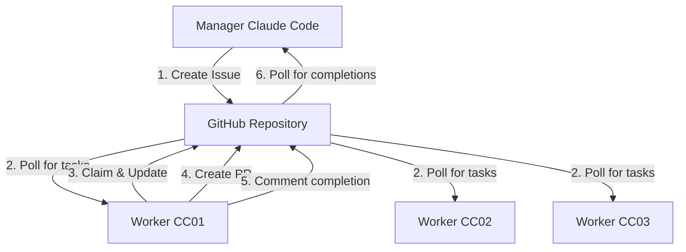

# 完全疎結合GitHub通信アーキテクチャ

## 概要

マネージャーとワーカー（CC01、CC02、CC03）が**完全に独立**して動作し、**GitHub経由のみ**で通信する設計。

## 基本原則

1. **ネットワーク非依存**: 同一ネットワーク・同一筐体である必要なし
2. **GitHub中心**: 全ての通信はGitHub Issue/PR経由
3. **Pull型通信**: 各ワーカーが自律的にタスクを取得
4. **非同期実行**: リアルタイム性不要、最終的な一貫性

## 通信フロー



## 実装方法

### 1. マネージャーの動作

```python
# マネージャーはIssueを作成するだけ
def create_task():
    gh.create_issue(
        title="Implement user authentication",
        body="Add JWT-based auth to the API",
        labels=["cc02", "backend", "priority-high"]
    )
```

### 2. ワーカーの動作（完全自律）

各ワーカーは独立したプロセス/マシンで動作：

```python
# CC02ワーカーの例
while True:
    # 自分のラベルが付いたIssueを検索
    issues = gh.get_issues(labels=["cc02"], state="open")
    
    for issue in issues:
        if not has_in_progress_label(issue):
            # タスクを取得
            claim_task(issue)
            process_task(issue)
            complete_task(issue)
    
    time.sleep(300)  # 5分ごとにポーリング
```

### 3. タスクのライフサイクル

```yaml
# Issue作成時
title: "Create login component"
labels: ["cc01", "frontend"]
state: open

# ワーカーが取得時
labels: ["cc01", "frontend", "in-progress"]
assignee: "worker-cc01"
comment: |
  Task claimed by CC01
  Started: 2025-01-24 10:00:00

# 進捗更新
comment: |
  Progress Update:
  - Component structure created
  - Working on styling

# 完了時
labels: ["cc01", "frontend", "completed", "ready-for-review"]
comment: |
  Task completed!
  PR: #123
  All tests passing
```

## メリット

### 1. 完全な独立性
- ワーカーは世界中のどこからでも実行可能
- ネットワーク障害の影響を受けない
- ファイアウォール設定不要

### 2. スケーラビリティ
- ワーカーの追加が容易（新しいラベルを作るだけ）
- 負荷分散が自然に実現（各ワーカーが自分のペースで処理）

### 3. 可視性
- 全ての通信がGitHub上で可視化
- 履歴が自動的に記録される
- 監査が容易

## 実装例

### ワーカー起動スクリプト

```bash
#!/bin/bash
# start-worker.sh

# 環境変数設定
export GITHUB_TOKEN="ghp_your_token"
export GITHUB_REPO="ootakazuhiko/claude-code-cluster"
export WORKER_NAME="CC02"
export WORKER_LABEL="cc02"

# ワーカー実行
python3 github-worker.py
```

### マネージャータスク作成

```bash
# タスク作成例
gh issue create \
  --title "Add user profile API" \
  --body "Create CRUD endpoints for user profiles" \
  --label "cc02"

# 複数ワーカーへの協調タスク
gh issue create \
  --title "Implement dashboard feature" \
  --body "Frontend: Create UI, Backend: Add API" \
  --label "cc01,cc02"
```

### 完了確認

```bash
# マネージャーが完了を確認
gh issue list --label "completed" --state "open"

# 特定ワーカーの作業を確認
gh issue list --assignee "worker-cc01" --state "all"
```

## セキュリティ考慮事項

1. **最小権限**: 各ワーカーは`repo`スコープのみ必要
2. **トークン管理**: 環境変数で管理、コードに含めない
3. **レート制限**: GitHub APIレート制限を考慮したポーリング間隔

## まとめ

この設計により：
- ✅ ワーカーの物理的な場所に依存しない
- ✅ ネットワーク設定不要
- ✅ GitHub APIのみで完結
- ✅ 非同期・疎結合な協調作業
- ✅ 完全な作業履歴の保持

が実現されます。