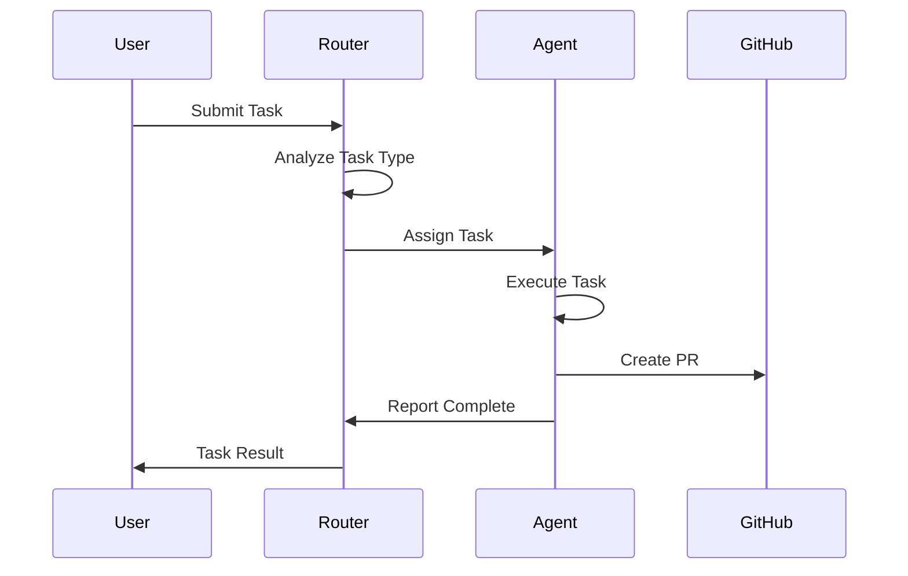
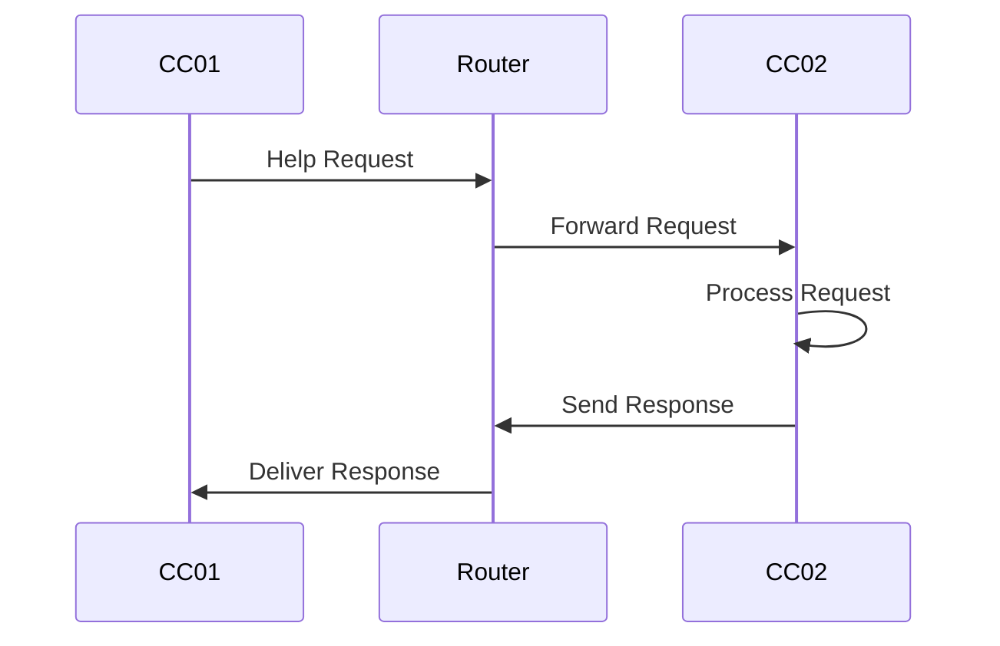

# Claude Code Cluster - システムアーキテクチャ詳細

## 📋 目次

1. [概要](#概要)
2. [システム構成](#システム構成)
3. [コンポーネント詳細](#コンポーネント詳細)
4. [通信フロー](#通信フロー)
5. [セキュリティモデル](#セキュリティモデル)
6. [スケーラビリティ](#スケーラビリティ)

## 概要

Claude Code Clusterは、複数のClaude Codeエージェントを協調動作させるための分散実行環境です。

### 主要な設計原則

- **分散アーキテクチャ**: 各エージェントが独立して動作
- **疎結合**: エージェント間はWebhook/APIで通信
- **専門特化**: 各エージェントが特定の領域に特化
- **自律性**: 各エージェントが自律的にタスクを実行
- **非同期処理**: タスクは非同期で並列実行

## システム構成

### 1. WSL2単一マシン構成（推奨）

```
┌─────────────────────────────────────────────────────────────┐
│                     Windows Host Machine                     │
├─────────────────────────────────────────────────────────────┤
│                          WSL2 Ubuntu                         │
│                                                              │
│  ┌─────────────────────────────────────────────────────┐   │
│  │              Central Router (Port 8888)              │   │
│  │  - Task Distribution                                 │   │
│  │  - Agent Health Monitoring                           │   │
│  │  - Message Routing                                   │   │
│  └──────────────────┬──────────┬──────────┬────────────┘   │
│                     │          │          │                  │
│  ┌──────────────────▼───┐ ┌───▼──────────┐ ┌───▼─────────┐ │
│  │   CC01 (Port 8881)   │ │ CC02 (8882)  │ │ CC03 (8883) │ │
│  │  Frontend Agent      │ │Backend Agent │ │ Infra Agent │ │
│  │  - React/TypeScript  │ │ - Python/API │ │ - CI/CD     │ │
│  │  - UI Components     │ │ - Database   │ │ - Docker    │ │
│  │  - User Experience   │ │ - Services   │ │ - Deploy    │ │
│  └──────────────────────┘ └──────────────┘ └─────────────┘ │
│                                                              │
│  ┌─────────────────────────────────────────────────────┐   │
│  │            Shared Resources (/home/claude-cluster)   │   │
│  │  - Task Queue      - Logs        - Artifacts        │   │
│  └─────────────────────────────────────────────────────┘   │
└──────────────────────────────────────────────────────────────┘
```

### 2. マルチPC構成（高度な用途）

```
┌─────────────────┐     ┌─────────────────────────────────┐
│   GitHub Repo   │────▶│    Coordinator Machine          │
└─────────────────┘     │  Central Router (Port 8888)     │
                        └────────────┬─────────────────────┘
                                     │
            ┌────────────────────────┼────────────────────────┐
            │                        │                        │
    ┌───────▼────────┐      ┌───────▼────────┐      ┌───────▼────────┐
    │   Machine 1    │      │   Machine 2    │      │   Machine 3    │
    │  CC01 Frontend │      │  CC02 Backend  │      │  CC03 Infra   │
    │  Port: 8881    │      │  Port: 8882    │      │  Port: 8883    │
    └────────────────┘      └────────────────┘      └────────────────┘
```

## コンポーネント詳細

### 1. Central Router

**役割**: タスク分配とエージェント間通信の中継

**主要機能**:
- タスクの受付と適切なエージェントへの振り分け
- エージェントの健全性監視
- メッセージのルーティング
- 負荷分散

**エンドポイント**:
```
GET  /                  # ルーター情報
GET  /health           # ヘルスチェック
GET  /agents/status    # 全エージェントステータス
POST /webhook          # メインWebhookエンドポイント
POST /task             # タスク送信
POST /broadcast        # 全エージェントへのブロードキャスト
```

### 2. Claude Code Agents

#### CC01 - Frontend Specialist
- **専門領域**: UI/UX開発
- **技術スタック**: React, TypeScript, CSS, HTML
- **責任範囲**:
  - コンポーネント開発
  - ユーザーインターフェース実装
  - レスポンシブデザイン
  - アクセシビリティ

#### CC02 - Backend Specialist
- **専門領域**: サーバーサイド開発
- **技術スタック**: Python, FastAPI, SQLAlchemy
- **責任範囲**:
  - API設計・実装
  - データベース操作
  - ビジネスロジック
  - 認証・認可

#### CC03 - Infrastructure Specialist
- **専門領域**: インフラストラクチャとDevOps
- **技術スタック**: Docker, Kubernetes, GitHub Actions
- **責任範囲**:
  - CI/CDパイプライン
  - コンテナ化
  - デプロイメント自動化
  - 監視・ログ設定

### 3. Hook System

各エージェントに実装されたイベント駆動システム:

```bash
~/.claude/hooks/
├── on-task-received.sh      # タスク受信時
├── on-progress-update.sh    # 進捗更新時
├── on-error.sh             # エラー発生時
├── on-task-complete.sh     # タスク完了時
├── on-agent-message.sh     # エージェント間メッセージ
├── on-github-event.sh      # GitHubイベント
└── on-resource-limit.sh    # リソース制限検知
```

## 通信フロー

### 1. タスク実行フロー



### 2. エージェント間協調



## セキュリティモデル

### 1. ユーザー権限

- **claude-user**: 非root実行ユーザー
- **claude-group**: エージェント管理グループ
- **--dangerously-skip-permissions**: 実行中断回避フラグ

### 2. ネットワークセキュリティ

- ローカルホストバインディング（デフォルト）
- オプションでHTTPS/TLS
- Webhook署名検証（GitHub統合時）

### 3. ファイルシステム

```
/home/claude-cluster/
├── agents/         # エージェント専用領域
├── shared/         # 共有リソース（制限付きアクセス）
└── scripts/        # 実行スクリプト（読み取り専用）
```

## スケーラビリティ

### 水平スケーリング

1. **エージェント追加**:
```bash
# 新しいエージェントの追加例
AGENT_NAME=cc04
AGENT_PORT=8884
AGENT_SPECIALTY=documentation
```

2. **負荷分散**:
- ラウンドロビン
- タスクタイプベース
- リソースベース

### 垂直スケーリング

- CPU/メモリ制限の調整
- 並行タスク数の設定
- キャッシュサイズの最適化

## パフォーマンス最適化

### 1. リソース管理

```yaml
# 推奨リソース割り当て
Central Router:
  CPU: 2 cores
  Memory: 4GB

Per Agent:
  CPU: 2-4 cores
  Memory: 4-8GB
  Storage: 50GB+
```

### 2. キャッシング戦略

- Git リポジトリキャッシュ
- 依存関係キャッシュ
- ビルドアーティファクトキャッシュ

### 3. 並行処理

- 非同期タスク実行
- バックグラウンドジョブ
- イベント駆動アーキテクチャ

## 監視とロギング

### 1. メトリクス

- タスク実行時間
- 成功/失敗率
- リソース使用率
- API応答時間

### 2. ログ構造

```
/home/claude-cluster/shared/logs/
├── router.log          # ルーターログ
├── cc01/              # エージェント別ログ
├── cc02/
├── cc03/
└── system.log         # システム全体ログ
```

### 3. アラート

- エージェントダウン検知
- リソース枯渇警告
- タスクタイムアウト
- エラー率上昇

## まとめ

Claude Code Clusterは、柔軟でスケーラブルな分散実行環境を提供します。WSL2上での単一マシン構成から始めて、必要に応じてマルチマシン構成へ拡張できる設計となっています。