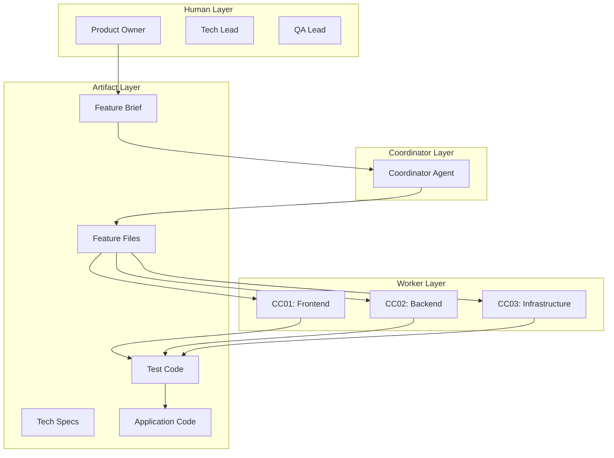
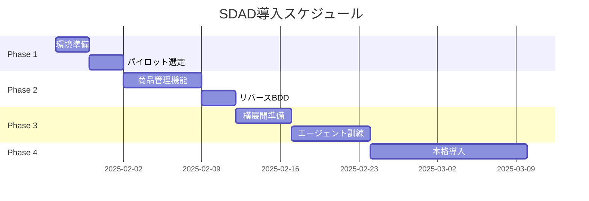

# SDAD × Claude Code Cluster 統合アーキテクチャ設計書

## 1. 概要

本文書は、ITDO_ERP2プロジェクトにおいて、仕様駆動AI開発（SDAD）手法とClaude Code Clusterシステムを統合するための設計指針を定義します。

### 1.1 設計原則

1. **人間主導の意思決定**: "Why"と"What"は人間が決定し、"How"はAIが実装
2. **最小構成優先**: 20人組織に適したシンプルなアーキテクチャ
3. **テスト駆動開発**: 実装前にテストを作成し、品質を保証
4. **明確な役割分担**: 各エージェントの責任範囲を厳密に定義

## 2. エージェント構成と役割

### 2.1 統合アーキテクチャ



### 2.2 各エージェントの役割定義

#### Coordinator Agent
```yaml
role: "SDAD Phase Manager & Task Distributor"
responsibilities:
  - フィーチャーブリーフからGherkinシナリオの生成
  - タスクパケットの作成と配布
  - エージェント間の調整
  - 品質ゲートの監視
constraints:
  - 実装コードを直接書かない
  - 人間の承認なしに次フェーズへ進まない
```

#### CC01: Frontend Agent
```yaml
role: "Frontend Implementation Specialist"
responsibilities:
  - React/TypeScriptコンポーネントの実装
  - Vitest/React Testing Libraryテストの作成
  - UI/UXの最小構成実装
constraints:
  - Material-UI不使用（Tailwind CSSのみ）
  - コンポーネント150行以内
  - 既存UIコンポーネントの再利用優先
```

#### CC02: Backend Agent
```yaml
role: "Backend API Implementation Specialist"
responsibilities:
  - FastAPI エンドポイントの実装
  - SQLAlchemy モデルの作成
  - Pytest テストの作成
constraints:
  - 8つのコアAPIに限定
  - SQLite使用（PostgreSQL不要）
  - シンプルなCRUD操作中心
```

#### CC03: Infrastructure Agent
```yaml
role: "DevOps & Automation Specialist"
responsibilities:
  - Docker Compose設定（Kubernetes不要）
  - CI/CDパイプライン管理
  - 開発環境自動化
constraints:
  - 最小構成のコンテナ化
  - GitHub Actions中心
  - 複雑なオーケストレーション禁止
```

## 3. SDAD フェーズ別タスクパケット定義

### 3.1 Phase 0: キックオフ
```yaml
# 人間のみが実行（エージェント関与なし）
actor: Product Owner
output: feature_brief.md
```

### 3.2 Phase 1: ディスカバリー
```yaml
Task_ID: ITDO-ERP2-Discovery-[Feature]-[Date]
Actor: Coordinator
Input_Artifacts:
  - feature_brief.md
  - requirements.md (#02_要件定義書.md)
Instructions: |
  フィーチャーブリーフを分析し、以下を生成してください：
  1. Gherkinシナリオ（5-10個）
  2. エッジケースリスト
  3. 受け入れ条件
Constraints:
  - 20人組織の利用シナリオに限定
  - 複雑な権限管理は不要
Output:
  - features/[feature].feature
  - docs/[feature]/acceptance_criteria.md
```

### 3.3 Phase 2: ドキュメント化
```yaml
Task_ID: ITDO-ERP2-Documentation-[Feature]-[Date]
Actor: CC01, CC02, CC03 (並列実行)
Input_Artifacts:
  - features/[feature].feature (承認済み)
Instructions: |
  担当領域の技術仕様を作成してください：
  CC01: UI設計、画面遷移図
  CC02: API仕様（OpenAPI）、データモデル
  CC03: デプロイメント構成
Constraints:
  - 最小構成での実装方法を提案
  - 既存コンポーネントの活用を明記
Output:
  - docs/[feature]/frontend_spec.md
  - docs/[feature]/api_spec.yaml
  - docs/[feature]/deployment_spec.md
```

### 3.4 Phase 3: バリデーション
```yaml
Task_ID: ITDO-ERP2-Validation-[Feature]-[Date]
Actor: CC01, CC02
Input_Artifacts:
  - 承認済み技術仕様書
Instructions: |
  仕様に基づき、失敗するテストを作成してください：
  CC01: Vitestコンポーネントテスト、E2Eテスト
  CC02: Pytest APIテスト、統合テスト
Non_Functional_Requirements:
  - カバレッジ目標: 80%
  - レスポンス時間: 200ms以内
Definition_of_Done:
  - [ ] 全シナリオに対応するテスト作成
  - [ ] テスト実行で全て失敗することを確認
  - [ ] CI/CDでの自動実行設定
```

### 3.5 Phase 4: ジェネレーション
```yaml
Task_ID: ITDO-ERP2-Generation-[Feature]-[Date]
Actor: CC01, CC02
Input_Artifacts:
  - 失敗するテスト群
  - 承認済み仕様書
Instructions: |
  テストが通るように実装してください。
  自律的にテスト実行と修正を繰り返してください。
Constraints:
  - TDDサイクル厳守（Red → Green → Refactor）
  - 最小限の実装（YAGNI原則）
  - 既存コードの再利用優先
Definition_of_Done:
  - [ ] 全テストがグリーン
  - [ ] Ruff/ESLintチェック通過
  - [ ] 型チェック通過
```

## 4. 自動化パイプライン

### 4.1 Git Hooks 設定
```bash
# .git/hooks/pre-commit
#!/bin/bash
# Phase検証
current_branch=$(git branch --show-current)
if [[ $current_branch =~ ^feature/issue-([0-9]+) ]]; then
    issue_number=${BASH_REMATCH[1]}
    # Issueのフェーズラベルを確認
    phase=$(gh issue view $issue_number --json labels -q '.labels[].name' | grep phase)
    
    # コミット内容とフェーズの整合性チェック
    if [[ $phase == "phase-3-validation" ]]; then
        # テストファイルのみ許可
        if git diff --cached --name-only | grep -v test; then
            echo "Error: Phase 3では、テストファイルのみコミット可能です"
            exit 1
        fi
    fi
fi

# 品質チェック
make lint
make typecheck
```

### 4.2 GitHub Actions ワークフロー
```yaml
name: SDAD Phase Gate
on:
  pull_request:
    types: [opened, synchronize]

jobs:
  phase-validation:
    runs-on: ubuntu-latest
    steps:
      - name: Check SDAD Phase
        run: |
          # PRのフェーズラベルを確認
          PHASE=$(gh pr view ${{ github.event.number }} --json labels -q '.labels[].name' | grep phase)
          
          # フェーズに応じた検証
          case $PHASE in
            "phase-1-discovery")
              # Feature fileの存在確認
              test -f features/*.feature || exit 1
              ;;
            "phase-2-documentation")
              # 仕様書の存在確認
              test -f docs/*/spec.md || exit 1
              ;;
            "phase-3-validation")
              # テストが失敗することを確認
              npm test && exit 1 || exit 0
              ;;
            "phase-4-generation")
              # テストが成功することを確認
              npm test || exit 1
              ;;
          esac
```

## 5. エージェント間連携プロトコル

### 5.1 情報共有メカニズム
```yaml
communication_channels:
  - GitHub Issues: フェーズ間の引き継ぎ
  - Pull Requests: コードレビューと承認
  - Project Board: 進捗の可視化
  - Markdown Docs: 仕様と設計の共有

information_flow:
  1. Coordinator → Workers: タスクパケット配布（Issue作成）
  2. Workers → Coordinator: 完了報告（PR作成）
  3. Human → All: 承認/却下（PR承認）
  4. Workers ↔ Workers: 依存関係調整（Issue comments）
```

### 5.2 エラーエスカレーション
```yaml
escalation_protocol:
  level_1:
    condition: "3回連続で同じテストが失敗"
    action: "該当Workerが仕様の明確化を要求"
    
  level_2:
    condition: "Worker間で矛盾する実装"
    action: "Coordinatorが調整会議を要求"
    
  level_3:
    condition: "フェーズ期限超過"
    action: "人間による介入と方針決定"
```

## 6. 実装チェックリスト

### 6.1 Coordinator 初期設定
- [ ] claude-code-cluster リポジトリのクローン
- [ ] SDAD用プロンプトテンプレートの作成
- [ ] フェーズ管理用Issueラベルの作成
- [ ] Project Boardの設定

### 6.2 Worker エージェント設定
- [ ] 各エージェント用の制約条件ファイル作成
- [ ] タスクパケット受信用のWebhook設定
- [ ] 自動テスト実行環境の構築
- [ ] エラーレポート機能の実装

### 6.3 品質保証メカニズム
- [ ] Phase Gate 実装（GitHub Actions）
- [ ] 自動コードレビュー設定
- [ ] メトリクス収集（実装時間、手戻り率）
- [ ] 週次振り返りプロセス

## 7. 移行スケジュール



## 8. 成功指標

| 指標 | 現状 | 目標 | 測定方法 |
|------|------|------|----------|
| API数 | 76 | 8 | APIエンドポイント数 |
| コンポーネント数 | 122 | 20 | React component数 |
| 平均実装時間 | 2週間/機能 | 3日/機能 | Issue close時間 |
| 手戻り率 | 40% | 10% | Revert commit率 |
| テストカバレッジ | 不明 | 80% | Coverage report |

## 9. 次のステップ

1. **即座に実行**:
   - claude-code-cluster環境のセットアップ
   - パイロット機能（商品管理）の選定確定

2. **今週中に完了**:
   - Coordinatorエージェントのプロンプト作成
   - Phase 1タスクパケットの作成

3. **2週間以内**:
   - パイロット実行と効果測定
   - 改善点の洗い出しと修正