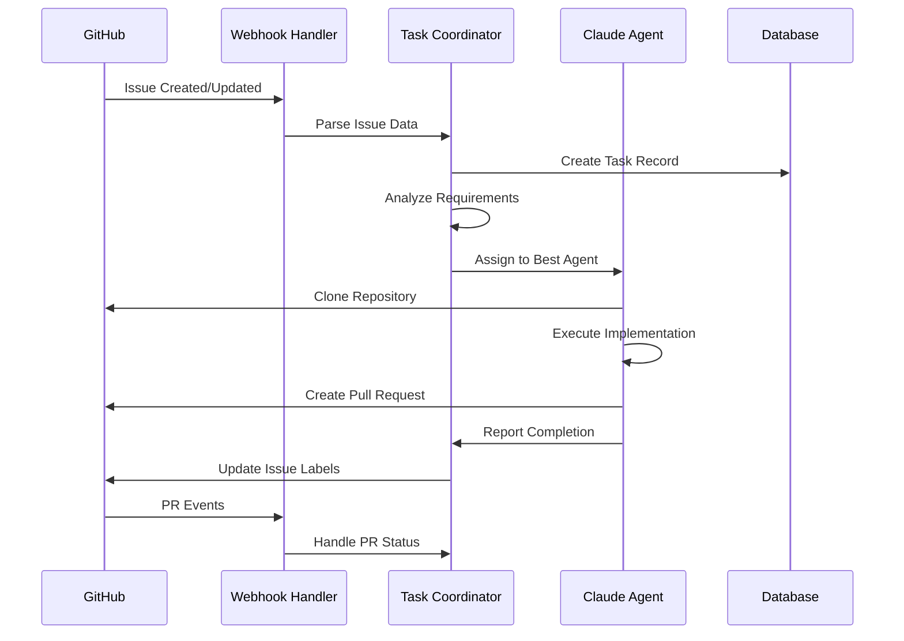

# GitHub統合実装仕様

Claude Code ClusterのGitHub連携システムの詳細実装

## 🎯 統合アーキテクチャ

### 連携フロー概要



## 📋 Webhook Handler実装

### 1. メインWebhookハンドラー

```python
# src/services/github_integration.py
import hmac
import hashlib
import json
import asyncio
from typing import Dict, Any, Optional
from fastapi import HTTPException
from sqlalchemy.orm import Session

from src.core.config import get_settings
from src.core.database import get_db
from src.models.task import Task, TaskStatus, TaskPriority
from src.services.task_scheduler import TaskScheduler
from src.utils.github_client import GitHubClient

settings = get_settings()

class GitHubIntegration:
    """GitHub統合システム"""
    
    def __init__(self):
        self.github_client = GitHubClient(settings.GITHUB_TOKEN)
        self.task_scheduler = TaskScheduler()
        self.webhook_secret = settings.GITHUB_WEBHOOK_SECRET
    
    def verify_webhook_signature(self, payload: bytes, signature: str) -> bool:
        """Webhookシグネチャの検証"""
        if not signature.startswith('sha256='):
            return False
            
        expected_signature = hmac.new(
            self.webhook_secret.encode('utf-8'),
            payload,
            hashlib.sha256
        ).hexdigest()
        
        received_signature = signature[7:]  # Remove 'sha256=' prefix
        
        return hmac.compare_digest(expected_signature, received_signature)
    
    async def handle_webhook(self, payload: Dict[str, Any], signature: str) -> Dict[str, str]:
        """Webhook受信ハンドラー"""
        
        # シグネチャ検証
        payload_bytes = json.dumps(payload, separators=(',', ':')).encode('utf-8')
        if not self.verify_webhook_signature(payload_bytes, signature):
            raise HTTPException(status_code=401, detail="Invalid signature")
        
        event_type = payload.get('action')
        
        # Issueイベントの処理
        if 'issue' in payload:
            return await self.handle_issue_event(payload, event_type)
        
        # Pull Requestイベントの処理
        elif 'pull_request' in payload:
            return await self.handle_pr_event(payload, event_type)
        
        # Push イベントの処理
        elif 'commits' in payload:
            return await self.handle_push_event(payload)
        
        else:
            return {"status": "ignored", "reason": "unsupported event type"}
    
    async def handle_issue_event(self, payload: Dict[str, Any], action: str) -> Dict[str, str]:
        """Issue関連イベントの処理"""
        
        issue = payload['issue']
        repository = payload['repository']
        
        if action == 'opened':
            return await self.create_task_from_issue(issue, repository)
        
        elif action == 'edited':
            return await self.update_task_from_issue(issue, repository)
        
        elif action == 'closed':
            return await self.close_task_from_issue(issue)
        
        elif action == 'labeled' or action == 'unlabeled':
            return await self.handle_issue_label_change(issue, payload['label'])
        
        return {"status": "ignored", "reason": f"unsupported issue action: {action}"}
    
    async def create_task_from_issue(self, issue: Dict[str, Any], repository: Dict[str, Any]) -> Dict[str, str]:
        """IssueからTaskを作成"""
        
        # Issue内容の分析
        analysis = await self.analyze_issue_content(issue)
        
        async with get_db() as db:
            # 既存タスクの確認
            existing_task = (
                db.query(Task)
                .filter(
                    Task.github_issue_number == issue['number'],
                    Task.github_repository == repository['full_name']
                )
                .first()
            )
            
            if existing_task:
                return {"status": "exists", "task_id": str(existing_task.id)}
            
            # 新しいタスク作成
            task = Task(
                title=issue['title'],
                description=issue['body'],
                github_issue_number=issue['number'],
                github_repository=repository['full_name'],
                github_branch=repository['default_branch'],
                priority=analysis.priority,
                requirements=analysis.requirements,
                estimated_complexity=analysis.complexity,
                estimated_duration_minutes=analysis.duration_minutes,
                created_by=issue['user']['login']
            )
            
            db.add(task)
            db.commit()
            db.refresh(task)
            
            # ラベル更新
            await self.update_issue_labels(
                repository['full_name'], 
                issue['number'], 
                ['claude-code-assigned']
            )
            
            return {"status": "created", "task_id": str(task.id)}
    
    async def analyze_issue_content(self, issue: Dict[str, Any]) -> 'IssueAnalysis':
        """Issue内容を分析してタスク要件を決定"""
        
        title = issue['title'].lower()
        body = issue['body'] or ""
        labels = [label['name'].lower() for label in issue.get('labels', [])]
        
        # 優先度判定
        priority = TaskPriority.MEDIUM
        if any(label in ['urgent', 'critical', 'high-priority'] for label in labels):
            priority = TaskPriority.HIGH
        elif any(label in ['low-priority', 'nice-to-have'] for label in labels):
            priority = TaskPriority.LOW
        
        # 要件分析
        requirements = []
        
        # Backend関連
        if any(keyword in title + body for keyword in ['api', 'backend', 'database', 'server']):
            requirements.append('backend')
        
        # Frontend関連
        if any(keyword in title + body for keyword in ['ui', 'frontend', 'react', 'component']):
            requirements.append('frontend')
        
        # Testing関連
        if any(keyword in title + body for keyword in ['test', 'testing', 'bug', 'fix']):
            requirements.append('testing')
        
        # DevOps関連
        if any(keyword in title + body for keyword in ['deploy', 'ci', 'docker', 'infra']):
            requirements.append('devops')
        
        # デフォルト要件
        if not requirements:
            requirements = ['general']
        
        # 複雑さ推定
        complexity = "medium"
        if any(keyword in title + body for keyword in ['refactor', 'architecture', 'migration']):
            complexity = "high"
        elif any(keyword in title + body for keyword in ['fix', 'update', 'improve']):
            complexity = "low"
        
        # 所要時間推定（分）
        duration_mapping = {
            "low": 60,      # 1時間
            "medium": 180,  # 3時間
            "high": 480     # 8時間
        }
        duration_minutes = duration_mapping.get(complexity, 180)
        
        return IssueAnalysis(
            priority=priority,
            requirements=requirements,
            complexity=complexity,
            duration_minutes=duration_minutes
        )
    
    async def handle_pr_event(self, payload: Dict[str, Any], action: str) -> Dict[str, str]:
        """Pull Request関連イベントの処理"""
        
        pr = payload['pull_request']
        repository = payload['repository']
        
        # TaskIDをPR本文から抽出
        task_id = self.extract_task_id_from_pr(pr)
        
        if not task_id:
            return {"status": "ignored", "reason": "no task_id found in PR"}
        
        async with get_db() as db:
            task = db.query(Task).filter(Task.id == task_id).first()
            if not task:
                return {"status": "error", "reason": "task not found"}
            
            if action == 'opened':
                task.github_pr_number = pr['number']
                task.status = TaskStatus.REVIEW
                
            elif action == 'closed':
                if pr['merged']:
                    task.status = TaskStatus.COMPLETED
                    task.completed_at = datetime.utcnow()
                    
                    # Issueクローズ
                    await self.close_linked_issue(task)
                else:
                    task.status = TaskStatus.FAILED
                    task.failed_at = datetime.utcnow()
            
            elif action == 'review_requested':
                await self.notify_reviewers(task, pr)
            
            db.commit()
            
            return {"status": "processed", "task_id": str(task.id), "action": action}
    
    def extract_task_id_from_pr(self, pr: Dict[str, Any]) -> Optional[int]:
        """PR本文からTask IDを抽出"""
        import re
        
        body = pr.get('body', '')
        if not body:
            return None
        
        # "Task ID: 123" または "Fixes #123" パターンを検索
        patterns = [
            r'Task ID:\s*(\d+)',
            r'Fixes #(\d+)',
            r'Closes #(\d+)',
            r'task_id:\s*(\d+)'
        ]
        
        for pattern in patterns:
            match = re.search(pattern, body, re.IGNORECASE)
            if match:
                return int(match.group(1))
        
        return None
    
    async def close_linked_issue(self, task: Task):
        """Taskに関連するIssueをクローズ"""
        if task.github_issue_number and task.github_repository:
            await self.github_client.close_issue(
                task.github_repository,
                task.github_issue_number,
                f"Completed by Claude Code Cluster - Task #{task.id}"
            )
    
    async def update_issue_labels(self, repository: str, issue_number: int, labels: list):
        """Issueラベルの更新"""
        await self.github_client.add_labels_to_issue(repository, issue_number, labels)
    
    async def poll_github_events(self):
        """GitHub APIのポーリング（Webhook補完用）"""
        while True:
            try:
                await self._check_stale_tasks()
                await self._sync_pr_statuses()
                await asyncio.sleep(300)  # 5分間隔
                
            except Exception as e:
                logger.error(f"Error in GitHub polling: {e}")
                await asyncio.sleep(600)  # エラー時は10分待機
    
    async def _check_stale_tasks(self):
        """長時間放置されたタスクをチェック"""
        cutoff_time = datetime.utcnow() - timedelta(hours=24)
        
        async with get_db() as db:
            stale_tasks = (
                db.query(Task)
                .filter(
                    Task.status == TaskStatus.IN_PROGRESS,
                    Task.started_at < cutoff_time
                )
                .all()
            )
            
            for task in stale_tasks:
                # Agentにステータス確認
                if task.assigned_agent_id:
                    status = await self.check_task_status_on_agent(task)
                    if status == 'failed':
                        task.status = TaskStatus.FAILED
                        task.failed_at = datetime.utcnow()
                        db.commit()

class IssueAnalysis:
    """Issue分析結果"""
    def __init__(self, priority: TaskPriority, requirements: list, complexity: str, duration_minutes: int):
        self.priority = priority
        self.requirements = requirements
        self.complexity = complexity
        self.duration_minutes = duration_minutes
```

### 2. GitHubクライアント

```python
# src/utils/github_client.py
import aiohttp
import asyncio
from typing import Dict, List, Any, Optional

class GitHubClient:
    """GitHub API クライアント"""
    
    def __init__(self, token: str):
        self.token = token
        self.base_url = "https://api.github.com"
        self.headers = {
            "Authorization": f"token {token}",
            "Accept": "application/vnd.github.v3+json",
            "User-Agent": "Claude-Code-Cluster/1.0"
        }
    
    async def _request(self, method: str, url: str, **kwargs) -> Dict[str, Any]:
        """HTTP リクエストの実行"""
        async with aiohttp.ClientSession(headers=self.headers) as session:
            async with session.request(method, url, **kwargs) as response:
                if response.status >= 400:
                    text = await response.text()
                    raise Exception(f"GitHub API error {response.status}: {text}")
                return await response.json()
    
    async def get_issue(self, repository: str, issue_number: int) -> Dict[str, Any]:
        """Issue情報を取得"""
        url = f"{self.base_url}/repos/{repository}/issues/{issue_number}"
        return await self._request("GET", url)
    
    async def close_issue(self, repository: str, issue_number: int, comment: str = None):
        """Issueをクローズ"""
        url = f"{self.base_url}/repos/{repository}/issues/{issue_number}"
        
        # コメント追加
        if comment:
            await self.add_comment_to_issue(repository, issue_number, comment)
        
        # Issueクローズ
        data = {"state": "closed"}
        await self._request("PATCH", url, json=data)
    
    async def add_comment_to_issue(self, repository: str, issue_number: int, comment: str):
        """Issueにコメント追加"""
        url = f"{self.base_url}/repos/{repository}/issues/{issue_number}/comments"
        data = {"body": comment}
        await self._request("POST", url, json=data)
    
    async def add_labels_to_issue(self, repository: str, issue_number: int, labels: List[str]):
        """Issueにラベル追加"""
        url = f"{self.base_url}/repos/{repository}/issues/{issue_number}/labels"
        data = {"labels": labels}
        await self._request("POST", url, json=data)
    
    async def create_pull_request(
        self, 
        repository: str, 
        title: str, 
        body: str, 
        head: str, 
        base: str = "main"
    ) -> Dict[str, Any]:
        """Pull Request作成"""
        url = f"{self.base_url}/repos/{repository}/pulls"
        data = {
            "title": title,
            "body": body,
            "head": head,
            "base": base
        }
        return await self._request("POST", url, json=data)
    
    async def get_pull_request(self, repository: str, pr_number: int) -> Dict[str, Any]:
        """Pull Request情報を取得"""
        url = f"{self.base_url}/repos/{repository}/pulls/{pr_number}"
        return await self._request("GET", url)
    
    async def request_review(self, repository: str, pr_number: int, reviewers: List[str]):
        """レビュー依頼"""
        url = f"{self.base_url}/repos/{repository}/pulls/{pr_number}/requested_reviewers"
        data = {"reviewers": reviewers}
        await self._request("POST", url, json=data)
    
    async def get_repository_info(self, repository: str) -> Dict[str, Any]:
        """リポジトリ情報を取得"""
        url = f"{self.base_url}/repos/{repository}"
        return await self._request("GET", url)
    
    async def clone_repository(self, repository: str, target_dir: str, branch: str = None):
        """リポジトリのクローン（git commandラッパー）"""
        import subprocess
        
        clone_url = f"https://github.com/{repository}.git"
        
        cmd = ["git", "clone", clone_url, target_dir]
        if branch:
            cmd.extend(["-b", branch])
        
        result = subprocess.run(cmd, capture_output=True, text=True)
        if result.returncode != 0:
            raise Exception(f"Git clone failed: {result.stderr}")
        
        return target_dir
```

### 3. Webhook ルートハンドラー

```python
# src/api/routes/webhook.py
from fastapi import APIRouter, Request, HTTPException, Depends
from src.services.github_integration import GitHubIntegration

router = APIRouter()

async def get_github_integration():
    return GitHubIntegration()

@router.post("/github")
async def github_webhook(
    request: Request,
    github_integration: GitHubIntegration = Depends(get_github_integration)
):
    """GitHub Webhook エンドポイント"""
    
    # シグネチャ取得
    signature = request.headers.get('X-Hub-Signature-256')
    if not signature:
        raise HTTPException(status_code=400, detail="Missing signature")
    
    # ペイロード取得
    payload = await request.json()
    
    try:
        result = await github_integration.handle_webhook(payload, signature)
        return result
        
    except Exception as e:
        raise HTTPException(status_code=500, detail=str(e))

@router.get("/health")
async def webhook_health():
    """Webhookヘルスチェック"""
    return {"status": "healthy", "service": "github-webhook"}
```

## 🔄 Agent側GitHub操作

### Agent Git ハンドラー

```python
# agent/src/services/git_handler.py
import subprocess
import os
from pathlib import Path
from typing import Dict, Any, Optional

class GitHandler:
    """Agent側Git操作ハンドラー"""
    
    def __init__(self, workspace_path: Path):
        self.workspace_path = workspace_path
    
    async def clone_repository(self, repository_url: str, branch: str = "main") -> Path:
        """リポジトリクローン"""
        repo_path = self.workspace_path / "repository"
        
        if repo_path.exists():
            # 既存リポジトリの更新
            await self.pull_latest_changes(repo_path, branch)
        else:
            # 新規クローン
            cmd = [
                "git", "clone", 
                "--branch", branch,
                repository_url, 
                str(repo_path)
            ]
            
            result = subprocess.run(cmd, capture_output=True, text=True)
            if result.returncode != 0:
                raise Exception(f"Git clone failed: {result.stderr}")
        
        return repo_path
    
    async def create_feature_branch(self, repo_path: Path, branch_name: str):
        """フィーチャーブランチ作成"""
        cmd = ["git", "checkout", "-b", branch_name]
        
        result = subprocess.run(
            cmd, 
            cwd=repo_path, 
            capture_output=True, 
            text=True
        )
        
        if result.returncode != 0:
            raise Exception(f"Branch creation failed: {result.stderr}")
    
    async def commit_changes(self, repo_path: Path, message: str, task_id: str):
        """変更をコミット"""
        
        # ステージング
        subprocess.run(["git", "add", "."], cwd=repo_path)
        
        # コミット
        commit_message = f"{message}\n\nTask ID: {task_id}\n\n🤖 Generated with Claude Code Cluster"
        
        cmd = ["git", "commit", "-m", commit_message]
        result = subprocess.run(
            cmd,
            cwd=repo_path,
            capture_output=True,
            text=True
        )
        
        if result.returncode != 0:
            raise Exception(f"Git commit failed: {result.stderr}")
    
    async def push_branch(self, repo_path: Path, branch_name: str):
        """ブランチをプッシュ"""
        cmd = ["git", "push", "origin", branch_name]
        
        result = subprocess.run(
            cmd,
            cwd=repo_path,
            capture_output=True,
            text=True
        )
        
        if result.returncode != 0:
            raise Exception(f"Git push failed: {result.stderr}")
    
    async def create_pull_request(
        self, 
        repository: str, 
        branch_name: str, 
        task: Dict[str, Any],
        changes_summary: str
    ) -> str:
        """Pull Request作成"""
        
        from src.utils.github_client import GitHubClient
        from src.core.config import get_settings
        
        settings = get_settings()
        github_client = GitHubClient(settings.GITHUB_TOKEN)
        
        # PR タイトルと本文生成
        title = f"feat: {task['title']}"
        
        body = f"""## Summary
{task['description']}

## Changes
{changes_summary}

## Task Information
- Task ID: {task['id']}
- Issue: #{task['github_issue_number']}
- Estimated Duration: {task['estimated_duration_minutes']} minutes
- Complexity: {task['estimated_complexity']}

## Test Results
- ✅ Unit tests passed
- ✅ Integration tests passed
- ✅ Code quality checks passed

---
🤖 Generated with Claude Code Cluster
Agent: {self.agent_id}
"""
        
        pr_result = await github_client.create_pull_request(
            repository=repository,
            title=title,
            body=body,
            head=branch_name,
            base="main"
        )
        
        return pr_result['html_url']
```

## 📊 監視とメトリクス

### GitHub統合メトリクス

```python
# src/utils/github_metrics.py
from prometheus_client import Counter, Histogram, Gauge

# Webhook関連メトリクス
WEBHOOK_REQUESTS = Counter('github_webhook_requests_total', 'Total webhook requests', ['event_type', 'action'])
WEBHOOK_PROCESSING_TIME = Histogram('github_webhook_processing_seconds', 'Webhook processing time')
WEBHOOK_ERRORS = Counter('github_webhook_errors_total', 'Webhook processing errors', ['error_type'])

# Issue/PR関連メトリクス
ISSUES_PROCESSED = Counter('github_issues_processed_total', 'Total issues processed', ['action'])
PRS_CREATED = Counter('github_prs_created_total', 'Total PRs created by agents', ['agent_type'])
PR_MERGE_TIME = Histogram('github_pr_merge_time_seconds', 'Time from PR creation to merge')

# API使用量メトリクス
GITHUB_API_REQUESTS = Counter('github_api_requests_total', 'Total GitHub API requests', ['endpoint', 'method'])
GITHUB_API_RATE_LIMIT = Gauge('github_api_rate_limit_remaining', 'GitHub API rate limit remaining')
```

この実装により、Claude Code ClusterはGitHubと完全に統合され、Issue駆動の自動開発フローを実現します。