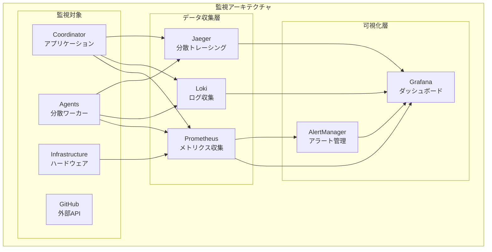

# 監視システム概要

Claude Code Clusterの包括的監視アーキテクチャ

## 🎯 監視戦略

### 監視の4つの柱



## 📊 監視対象とメトリクス

### 1. アプリケーションメトリクス

**Coordinator 監視項目**
```python
# タスク関連メトリクス
tasks_total = Counter('claude_tasks_total', 'Total tasks processed', ['status', 'priority'])
tasks_duration = Histogram('claude_task_duration_seconds', 'Task execution time', ['agent_type'])
tasks_queue_size = Gauge('claude_tasks_queue_size', 'Number of tasks in queue')
tasks_active = Gauge('claude_tasks_active', 'Number of active tasks')

# Agent関連メトリクス  
agents_total = Gauge('claude_agents_total', 'Total number of agents')
agents_available = Gauge('claude_agents_available', 'Available agents')
agents_load = Gauge('claude_agent_load', 'Agent load percentage', ['agent_id', 'specialty'])
agents_heartbeat = Gauge('claude_agent_last_heartbeat', 'Last heartbeat timestamp', ['agent_id'])

# API関連メトリクス
api_requests_total = Counter('claude_api_requests_total', 'Total API requests', ['method', 'endpoint', 'status'])
api_request_duration = Histogram('claude_api_request_duration_seconds', 'API request duration')

# GitHub統合メトリクス
github_webhooks_total = Counter('claude_github_webhooks_total', 'GitHub webhooks received', ['event_type'])
github_api_calls = Counter('claude_github_api_calls_total', 'GitHub API calls', ['endpoint'])
github_rate_limit = Gauge('claude_github_rate_limit_remaining', 'GitHub API rate limit remaining')

# データベースメトリクス
db_connections_active = Gauge('claude_db_connections_active', 'Active database connections')
db_query_duration = Histogram('claude_db_query_duration_seconds', 'Database query duration')
```

**Agent 監視項目**
```python
# タスク実行メトリクス
agent_tasks_completed = Counter('claude_agent_tasks_completed_total', 'Tasks completed', ['agent_id'])
agent_tasks_failed = Counter('claude_agent_tasks_failed_total', 'Tasks failed', ['agent_id'])
agent_task_duration = Histogram('claude_agent_task_duration_seconds', 'Agent task duration', ['agent_id'])

# ワークスペースメトリクス
workspace_disk_usage = Gauge('claude_workspace_disk_usage_bytes', 'Workspace disk usage', ['agent_id'])
workspace_active_tasks = Gauge('claude_workspace_active_tasks', 'Active tasks in workspace', ['agent_id'])

# Claude API メトリクス
claude_api_requests = Counter('claude_api_requests_total', 'Claude API requests', ['agent_id'])
claude_api_tokens = Counter('claude_api_tokens_total', 'Claude API tokens used', ['agent_id', 'type'])
claude_api_duration = Histogram('claude_api_request_duration_seconds', 'Claude API request duration')

# Git操作メトリクス
git_operations_total = Counter('claude_git_operations_total', 'Git operations', ['agent_id', 'operation'])
git_operation_duration = Histogram('claude_git_operation_duration_seconds', 'Git operation duration')
```

### 2. インフラメトリクス

**システムリソース監視**
```yaml
# Node Exporter メトリクス
- CPU使用率: node_cpu_seconds_total
- メモリ使用量: node_memory_MemAvailable_bytes
- ディスク使用量: node_filesystem_avail_bytes
- ネットワークトラフィック: node_network_receive_bytes_total
- ロードアベレージ: node_load1

# Docker メトリクス
- コンテナ状態: container_last_seen
- CPU使用率: container_cpu_usage_seconds_total
- メモリ使用量: container_memory_usage_bytes
- ネットワークI/O: container_network_receive_bytes_total
```

### 3. ビジネスメトリクス

```python
# 開発効率メトリクス
development_velocity = Gauge('claude_development_velocity', 'PRs per hour')
code_quality_score = Gauge('claude_code_quality_score', 'Average code quality score')
bug_detection_rate = Gauge('claude_bug_detection_rate', 'Bugs detected per PR')

# コスト効率メトリクス  
cost_per_task = Gauge('claude_cost_per_task_usd', 'Cost per completed task')
claude_api_cost = Counter('claude_api_cost_usd_total', 'Total Claude API cost')
infrastructure_cost = Gauge('claude_infrastructure_cost_usd_daily', 'Daily infrastructure cost')

# 品質メトリクス
test_coverage = Gauge('claude_test_coverage_percentage', 'Test coverage percentage', ['repo'])
pr_approval_rate = Gauge('claude_pr_approval_rate', 'PR approval rate')
deployment_success_rate = Gauge('claude_deployment_success_rate', 'Deployment success rate')
```

## 📈 Grafanaダッシュボード設計

### 1. Executive Dashboard

```json
{
  "dashboard": {
    "title": "Claude Code Cluster - Executive Overview",
    "panels": [
      {
        "title": "システム概要",
        "type": "stat",
        "targets": [
          {
            "expr": "claude_agents_total",
            "legendFormat": "総Agent数"
          },
          {
            "expr": "claude_tasks_active",
            "legendFormat": "実行中タスク"
          },
          {
            "expr": "rate(claude_tasks_total[1h]) * 3600",
            "legendFormat": "1時間あたりタスク完了数"
          }
        ]
      },
      {
        "title": "開発効率トレンド",
        "type": "graph",
        "targets": [
          {
            "expr": "rate(claude_tasks_total{status=\"completed\"}[1h]) * 3600",
            "legendFormat": "完了タスク/時間"
          },
          {
            "expr": "claude_development_velocity",
            "legendFormat": "PR作成数/時間"
          }
        ]
      },
      {
        "title": "コスト分析",
        "type": "bargauge",
        "targets": [
          {
            "expr": "claude_api_cost_usd_total",
            "legendFormat": "Claude API コスト"
          },
          {
            "expr": "claude_infrastructure_cost_usd_daily",
            "legendFormat": "インフラコスト/日"
          }
        ]
      }
    ]
  }
}
```

### 2. Technical Operations Dashboard

```json
{
  "dashboard": {
    "title": "Claude Code Cluster - Technical Operations",
    "panels": [
      {
        "title": "Agent状態",
        "type": "table",
        "targets": [
          {
            "expr": "claude_agent_load",
            "format": "table",
            "legendFormat": ""
          }
        ],
        "transformations": [
          {
            "id": "organize",
            "options": {
              "includeByName": {
                "agent_id": true,
                "specialty": true,
                "Value": true
              },
              "renameByName": {
                "agent_id": "Agent ID",
                "specialty": "専門分野",
                "Value": "負荷率 (%)"
              }
            }
          }
        ]
      },
      {
        "title": "タスクキュー",
        "type": "graph",
        "targets": [
          {
            "expr": "claude_tasks_queue_size",
            "legendFormat": "キュー内タスク数"
          },
          {
            "expr": "claude_tasks_active", 
            "legendFormat": "実行中タスク"
          }
        ]
      },
      {
        "title": "リソース使用率",
        "type": "heatmap",
        "targets": [
          {
            "expr": "avg by (instance) (100 - (avg(irate(node_cpu_seconds_total{mode=\"idle\"}[5m])) * 100))",
            "legendFormat": "CPU使用率"
          }
        ]
      }
    ]
  }
}
```

### 3. Agent Performance Dashboard

```json
{
  "dashboard": {
    "title": "Claude Code Cluster - Agent Performance",
    "panels": [
      {
        "title": "Agent別タスク完了数",
        "type": "graph",
        "targets": [
          {
            "expr": "rate(claude_agent_tasks_completed_total[5m])",
            "legendFormat": "{{agent_id}}"
          }
        ]
      },
      {
        "title": "Claude API レスポンス時間",
        "type": "graph",
        "targets": [
          {
            "expr": "histogram_quantile(0.95, rate(claude_api_request_duration_seconds_bucket[5m]))",
            "legendFormat": "95パーセンタイル"
          },
          {
            "expr": "histogram_quantile(0.50, rate(claude_api_request_duration_seconds_bucket[5m]))",
            "legendFormat": "中央値"
          }
        ]
      },
      {
        "title": "ワークスペースディスク使用量",
        "type": "graph",
        "targets": [
          {
            "expr": "claude_workspace_disk_usage_bytes / 1024 / 1024 / 1024",
            "legendFormat": "{{agent_id}} (GB)"
          }
        ]
      }
    ]
  }
}
```

## 🚨 アラート設定

### 1. Critical Alerts

```yaml
# alerts/critical.yml
groups:
  - name: claude-cluster-critical
    rules:
      - alert: CoordinatorDown
        expr: up{job="claude-coordinator"} == 0
        for: 1m
        labels:
          severity: critical
        annotations:
          summary: "Claude Coordinator is down"
          description: "The Claude Code Coordinator has been down for more than 1 minute"

      - alert: AllAgentsDown
        expr: claude_agents_available == 0
        for: 5m
        labels:
          severity: critical
        annotations:
          summary: "All Claude Agents are unavailable"
          description: "No Claude Agents are available for task execution"

      - alert: DatabaseDown
        expr: up{job="postgresql"} == 0
        for: 2m
        labels:
          severity: critical
        annotations:
          summary: "PostgreSQL database is down"
          description: "The main PostgreSQL database is unreachable"

      - alert: TaskQueueOverflow
        expr: claude_tasks_queue_size > 100
        for: 10m
        labels:
          severity: critical
        annotations:
          summary: "Task queue is overflowing"
          description: "Task queue has {{ $value }} pending tasks for more than 10 minutes"
```

### 2. Warning Alerts

```yaml
# alerts/warning.yml
groups:
  - name: claude-cluster-warning
    rules:
      - alert: HighAgentLoad
        expr: claude_agent_load > 90
        for: 15m
        labels:
          severity: warning
        annotations:
          summary: "Agent {{ $labels.agent_id }} is under high load"
          description: "Agent {{ $labels.agent_id }} has been over 90% load for 15 minutes"

      - alert: SlowTaskExecution
        expr: histogram_quantile(0.95, rate(claude_task_duration_seconds_bucket[10m])) > 3600
        for: 5m
        labels:
          severity: warning
        annotations:
          summary: "Task execution is slower than expected"
          description: "95th percentile task duration is {{ $value }} seconds"

      - alert: HighClaudeAPILatency
        expr: histogram_quantile(0.95, rate(claude_api_request_duration_seconds_bucket[5m])) > 60
        for: 5m
        labels:
          severity: warning
        annotations:
          summary: "High Claude API latency detected"
          description: "Claude API 95th percentile latency is {{ $value }} seconds"

      - alert: LowDiskSpace
        expr: (node_filesystem_avail_bytes / node_filesystem_size_bytes) * 100 < 10
        for: 5m
        labels:
          severity: warning
        annotations:
          summary: "Low disk space on {{ $labels.instance }}"
          description: "Disk space is below 10% on {{ $labels.instance }}"
```

### 3. Information Alerts

```yaml
# alerts/info.yml
groups:
  - name: claude-cluster-info
    rules:
      - alert: NewAgentRegistered
        expr: increase(claude_agents_total[1m]) > 0
        labels:
          severity: info
        annotations:
          summary: "New agent registered"
          description: "A new agent has been registered with the cluster"

      - alert: HighDevelopmentVelocity
        expr: claude_development_velocity > 10
        for: 1h
        labels:
          severity: info
        annotations:
          summary: "High development velocity achieved"
          description: "Development velocity is {{ $value }} PRs per hour"

      - alert: ClaudeAPIRateLimitApproaching
        expr: claude_github_rate_limit_remaining < 100
        labels:
          severity: info
        annotations:
          summary: "Claude API rate limit approaching"
          description: "{{ $value }} API calls remaining until rate limit"
```

## 🔍 ログ管理

### 1. ログ収集設定

```yaml
# promtail/config.yml
server:
  http_listen_port: 9080
  grpc_listen_port: 0

positions:
  filename: /tmp/positions.yaml

clients:
  - url: http://loki:3100/loki/api/v1/push

scrape_configs:
  - job_name: coordinator-logs
    static_configs:
      - targets:
          - localhost
        labels:
          job: coordinator
          __path__: /opt/coordinator/logs/*.log

  - job_name: agent-logs
    static_configs:
      - targets:
          - localhost
        labels:
          job: agent
          __path__: /opt/agent/logs/*.log

  - job_name: system-logs
    journal:
      max_age: 12h
      labels:
        job: systemd-journal
```

### 2. ログ構造化

```python
# src/core/logging.py
import logging
import json
from datetime import datetime
from typing import Dict, Any

class StructuredLogger:
    """構造化ログ出力"""
    
    def __init__(self, name: str):
        self.logger = logging.getLogger(name)
        handler = logging.StreamHandler()
        handler.setFormatter(StructuredFormatter())
        self.logger.addHandler(handler)
        self.logger.setLevel(logging.INFO)
    
    def info(self, message: str, **kwargs):
        """情報ログ出力"""
        self._log("INFO", message, kwargs)
    
    def error(self, message: str, **kwargs):
        """エラーログ出力"""
        self._log("ERROR", message, kwargs)
    
    def _log(self, level: str, message: str, extra: Dict[str, Any]):
        """構造化ログ出力"""
        log_entry = {
            "timestamp": datetime.utcnow().isoformat(),
            "level": level,
            "message": message,
            "service": "claude-cluster",
            **extra
        }
        self.logger.info(json.dumps(log_entry))

class StructuredFormatter(logging.Formatter):
    """JSON形式ログフォーマッター"""
    
    def format(self, record):
        return record.getMessage()
```

## 📱 通知設定

### AlertManager設定

```yaml
# alertmanager/config.yml
global:
  smtp_smarthost: 'smtp.gmail.com:587'
  smtp_from: 'claude-cluster@your-domain.com'

route:
  group_by: ['alertname']
  group_wait: 10s
  group_interval: 10s
  repeat_interval: 1h
  receiver: 'default'
  routes:
    - match:
        severity: critical
      receiver: 'critical-alerts'
    - match:
        severity: warning  
      receiver: 'warning-alerts'

receivers:
  - name: 'default'
    email_configs:
      - to: 'ops-team@your-domain.com'
        subject: 'Claude Cluster Alert: {{ .GroupLabels.alertname }}'
        body: |
          {{ range .Alerts }}
          Alert: {{ .Annotations.summary }}
          Description: {{ .Annotations.description }}
          {{ end }}

  - name: 'critical-alerts'
    email_configs:
      - to: 'critical-alerts@your-domain.com'
        subject: '🚨 CRITICAL: Claude Cluster Alert'
    slack_configs:
      - api_url: 'YOUR_SLACK_WEBHOOK_URL'
        channel: '#claude-cluster-alerts'
        title: 'Critical Alert'
        text: '{{ .CommonAnnotations.summary }}'

  - name: 'warning-alerts'
    email_configs:
      - to: 'warnings@your-domain.com'
        subject: '⚠️ WARNING: Claude Cluster Alert'
```

この包括的監視システムにより、Claude Code Clusterの健全性とパフォーマンスを24時間365日監視できます。