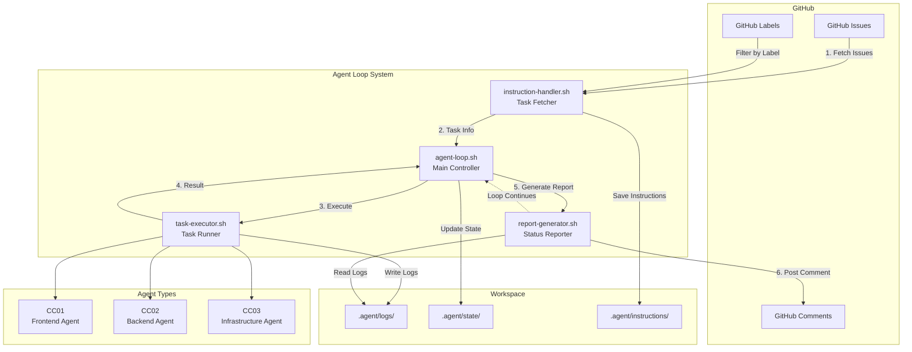

# Agent Instruction System Architecture

## Overview

The Agent Instruction System is a continuous loop architecture that enables Claude Code agents to autonomously fetch, execute, and report on tasks from GitHub Issues.

## Architecture Diagram



## Component Details

### 1. agent-loop.sh (Main Controller)
- **Purpose**: Orchestrates the continuous instruction processing loop
- **Key Functions**:
  - Health checks and prerequisite validation
  - Workspace directory initialization
  - Loop iteration control
  - Signal handling for graceful shutdown

### 2. instruction-handler.sh (Task Fetcher)
- **Purpose**: Fetches and prioritizes tasks from GitHub Issues
- **Key Functions**:
  - Query GitHub API for labeled issues
  - Priority detection (URGENT/PRIORITY/P1)
  - Stagnation detection (30-minute threshold)
  - Task metadata extraction

### 3. task-executor.sh (Task Runner)
- **Purpose**: Executes tasks based on type and agent specialization
- **Key Functions**:
  - Task type routing (test/fix/implement)
  - Agent-specific implementations
  - Git operations and branch management
  - Error handling and recovery

### 4. report-generator.sh (Status Reporter)
- **Purpose**: Generates and submits status reports to GitHub
- **Key Functions**:
  - Success/failure/progress report generation
  - Metrics collection (execution time, file changes)
  - GitHub Issue comment posting
  - Work status tracking

## Data Flow

1. **Instruction Reception**
   ```
   GitHub Issue (with label) → instruction-handler.sh → instruction_${issue}.md
   ```

2. **Task Execution**
   ```
   instruction_${issue}.md → task-executor.sh → Agent-specific implementation
   ```

3. **Status Reporting**
   ```
   Execution result → report-generator.sh → GitHub Issue Comment
   ```

## File System Structure

```
$WORKSPACE/
└── .agent/
    ├── logs/
    │   ├── agent-loop.log
    │   ├── instruction-handler.log
    │   ├── task-executor.log
    │   ├── report-generator.log
    │   └── task_output_${issue}.log
    ├── state/
    │   ├── active_issue_${AGENT_NAME}
    │   ├── last_activity_${AGENT_NAME}
    │   └── work_${issue}.status
    └── instructions/
        └── instruction_${issue}.md
```

## Agent Specializations

### CC01 - Frontend Agent
- **Focus**: React/TypeScript components
- **Task Types**: UI implementation, component testing, styling
- **Tools**: npm, TypeScript compiler, React Testing Library

### CC02 - Backend Agent
- **Focus**: Python/FastAPI services
- **Task Types**: API endpoints, database operations, backend logic
- **Tools**: uv, pytest, mypy, ruff

### CC03 - Infrastructure Agent
- **Focus**: CI/CD and deployment
- **Task Types**: GitHub Actions, Docker configurations, monitoring
- **Tools**: gh CLI, Docker, workflow automation

## Communication Protocol

### Issue Format
```yaml
Title: "[AGENT_ID] Task Description"
Labels: [agent_label, task_type, priority]
Body: |
  ## Task Details
  - Type: test/fix/implement
  - Priority: high/medium/low
  - Description: Detailed task description
  - Success Criteria: Expected outcomes
```

### Report Format
```markdown
## ${AGENT_NAME} Status Report
**Status**: start/success/failure/progress
**Time**: ${timestamp}
**Details**: Task-specific information
**Metrics**: Execution time, files modified, tests passed
```

## Error Handling

1. **Stagnation Detection**: 30-minute inactivity threshold
2. **Graceful Shutdown**: Signal handlers for clean termination
3. **Work Recovery**: State files for resuming interrupted tasks
4. **Automatic Cleanup**: Temporary file removal after completion

## Security Considerations

- No `/tmp` access - all files within `$WORKSPACE/.agent/`
- GitHub authentication via `gh` CLI
- API key management through environment variables
- Workspace isolation per agent

## Configuration

### Environment Variables
- `AGENT_NAME`: Unique agent identifier
- `ISSUE_LABEL`: GitHub label for filtering
- `WORKSPACE`: Base directory path
- `LOOP_DELAY`: Seconds between iterations
- `MAX_ITERATIONS`: Loop limit (0=infinite)

### Customization Points
- Task type handlers in `task-executor.sh`
- Report templates in `report-generator.sh`
- Priority markers in `instruction-handler.sh`
- Agent-specific implementations