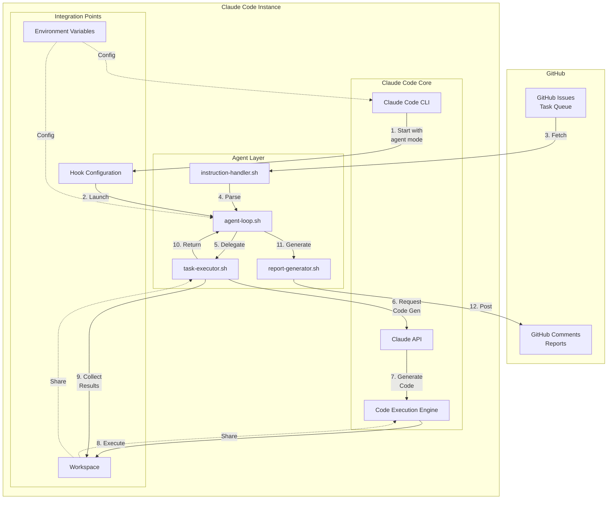

# Claude Code and Agent System Integration

## Overview

This document explains how Claude Code integrates with the agent instruction system to enable autonomous task execution.

## Integration Architecture



## Integration Methods

### Method 1: Claude Code Hooks (Recommended)

The agent system integrates with Claude Code through the hooks mechanism:

```bash
# .claude-code/hooks/on-idle.sh
#!/bin/bash
# This hook runs when Claude Code is idle

# Check for new tasks
TASK=$(./scripts/agent/instruction-handler.sh)
if [ -n "$TASK" ]; then
    # Signal Claude Code to process the task
    echo "NEW_TASK:$TASK"
fi
```

```bash
# .claude-code/hooks/post-command.sh
#!/bin/bash
# This hook runs after Claude Code executes a command

# Generate and post report
./scripts/agent/report-generator.sh "$CLAUDE_CODE_RESULT"
```

### Method 2: Direct CLI Integration

Claude Code can be invoked directly with specific tasks:

```bash
# Run Claude Code with a specific GitHub issue
claude-code --task "github:issue:123" \
            --mode "autonomous" \
            --report "github:comment"
```

### Method 3: Continuous Agent Mode

Claude Code runs in a continuous loop with the agent system:

```bash
# Start Claude Code in agent mode
claude-code --agent \
            --config ./scripts/agent/claude-code-config.yaml \
            --workspace /home/work/project
```

## Configuration

### claude-code-config.yaml
```yaml
agent:
  mode: continuous
  scripts:
    fetch: ./scripts/agent/instruction-handler.sh
    execute: ./scripts/agent/task-executor.sh
    report: ./scripts/agent/report-generator.sh
  
  workspace:
    base: /home/work/project
    logs: .agent/logs
    state: .agent/state
    
  github:
    labels:
      - cc01  # Frontend tasks
      - cc02  # Backend tasks
      - cc03  # Infrastructure tasks
    
  loop:
    delay: 60  # seconds
    max_iterations: 0  # unlimited
```

## Task Flow with Claude Code

### 1. Task Acquisition
```
GitHub Issue → instruction-handler.sh → Claude Code receives task metadata
```

### 2. Code Generation
```
Claude Code → Analyzes task → Calls Claude API → Generates solution
```

### 3. Code Execution
```
Claude Code → Executes generated code → Captures results → Updates workspace
```

### 4. Reporting
```
Execution results → report-generator.sh → GitHub comment
```

## Key Integration Points

### Environment Variables
```bash
# Required for Claude Code
export ANTHROPIC_API_KEY="sk-ant-..."
export GITHUB_TOKEN="ghp_..."
export CLAUDE_CODE_AGENT_MODE="true"
export CLAUDE_CODE_WORKSPACE="/home/work/project"
```

### Workspace Sharing
Claude Code and agent scripts share the same workspace:
- Code files generated by Claude Code
- Logs and state tracked by agent scripts
- Git operations coordinated between both

### API Interactions
```
┌─────────────────┐     ┌─────────────────┐     ┌─────────────────┐
│  GitHub API     │────▶│  Claude Code    │────▶│  Claude API     │
│  (Tasks)        │     │  (Orchestrator) │     │  (AI)           │
└─────────────────┘     └─────────────────┘     └─────────────────┘
         ▲                       │                        │
         │                       ▼                        ▼
         │              ┌─────────────────┐     ┌─────────────────┐
         └──────────────│  Agent Scripts  │────▶│  Code Execution │
                        │  (Automation)   │     │  (Local)        │
                        └─────────────────┘     └─────────────────┘
```

## Security Considerations

1. **API Key Management**: Keys are never exposed in logs or reports
2. **Workspace Isolation**: Each agent has its own workspace
3. **GitHub Permissions**: Limited to specific repository and labels
4. **Code Execution**: Sandboxed within Claude Code's security model

## Example Usage

### Starting an Agent
```bash
# Set up environment
export ANTHROPIC_API_KEY="sk-ant-..."
export GITHUB_TOKEN="ghp_..."
export AGENT_NAME="CC01"
export ISSUE_LABEL="cc01"

# Start Claude Code with agent scripts
claude-code --command "./scripts/agent/agent-loop.sh CC01 cc01"
```

### Manual Task Trigger
```bash
# Create a GitHub issue
gh issue create --title "[CC01] Implement Button Component" \
                --label "cc01" \
                --body "Create a reusable Button component with TypeScript"

# Claude Code agent will automatically pick it up in the next loop iteration
```

## Monitoring

### Agent Status
```bash
# Check agent logs
tail -f .agent/logs/agent-loop.log

# Check active task
cat .agent/state/active_issue_CC01

# Monitor Claude Code activity
claude-code --status
```

### Performance Metrics
- Task completion time
- Code generation accuracy
- Test pass rate
- GitHub API rate limits

## Troubleshooting

### Common Issues

1. **Claude Code not picking up tasks**
   - Check GitHub authentication
   - Verify label configuration
   - Ensure hooks are executable

2. **Code execution failures**
   - Check workspace permissions
   - Verify dependencies installed
   - Review Claude Code logs

3. **Report posting errors**
   - Confirm GitHub token permissions
   - Check API rate limits
   - Verify issue numbers

## Future Enhancements

1. **Parallel Task Execution**: Multiple Claude Code instances
2. **Task Dependencies**: Coordinated multi-agent workflows
3. **Learning System**: Improve code generation based on feedback
4. **Custom Prompts**: Task-specific Claude instructions